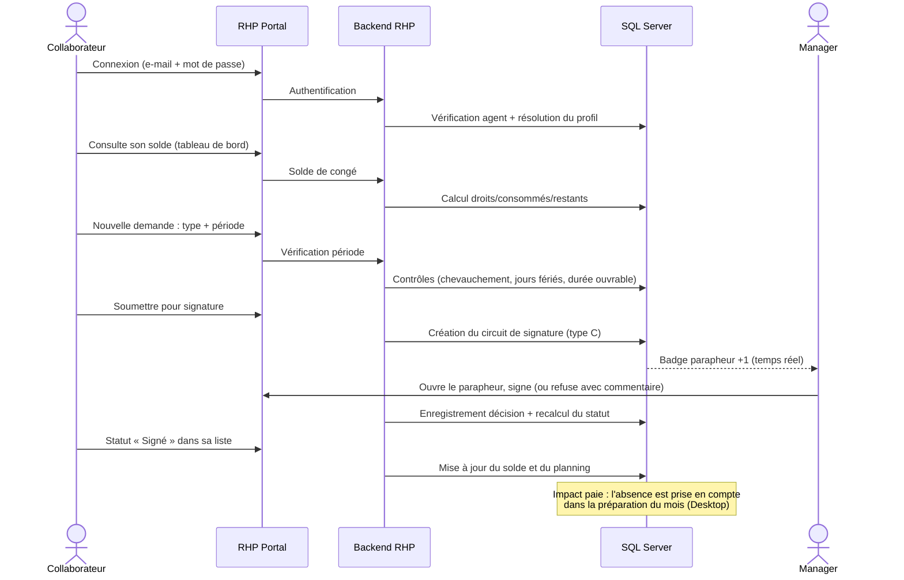
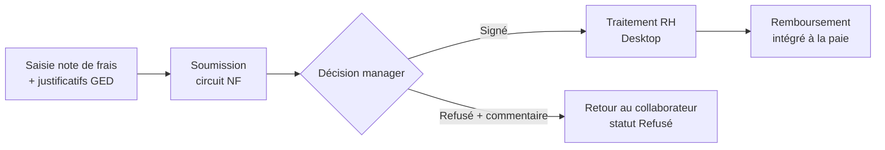
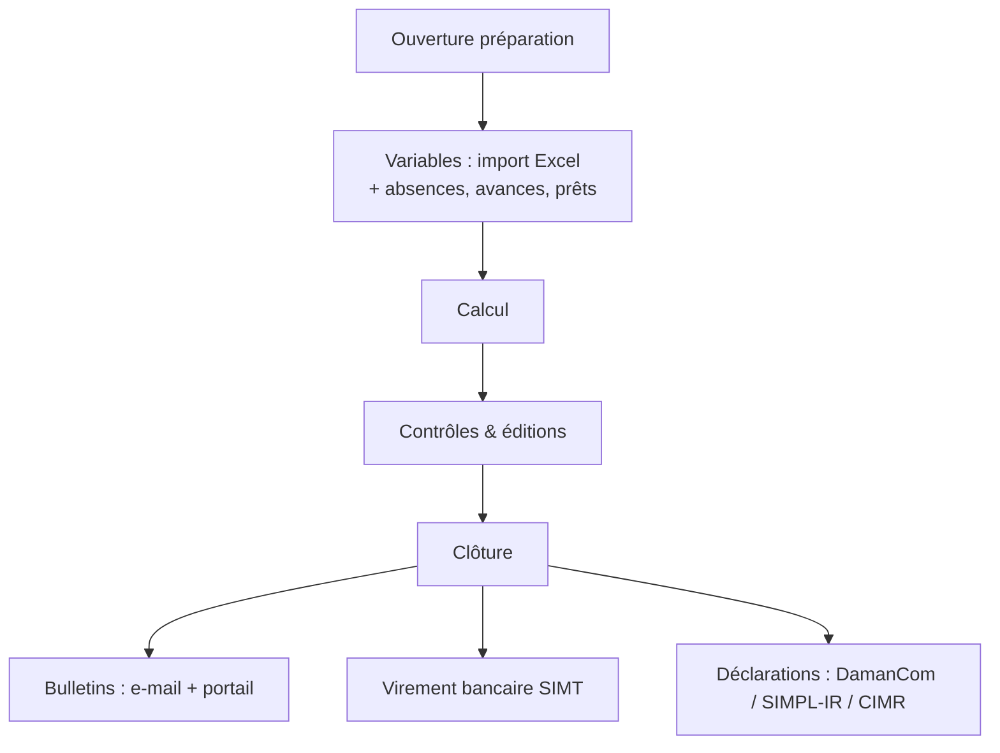
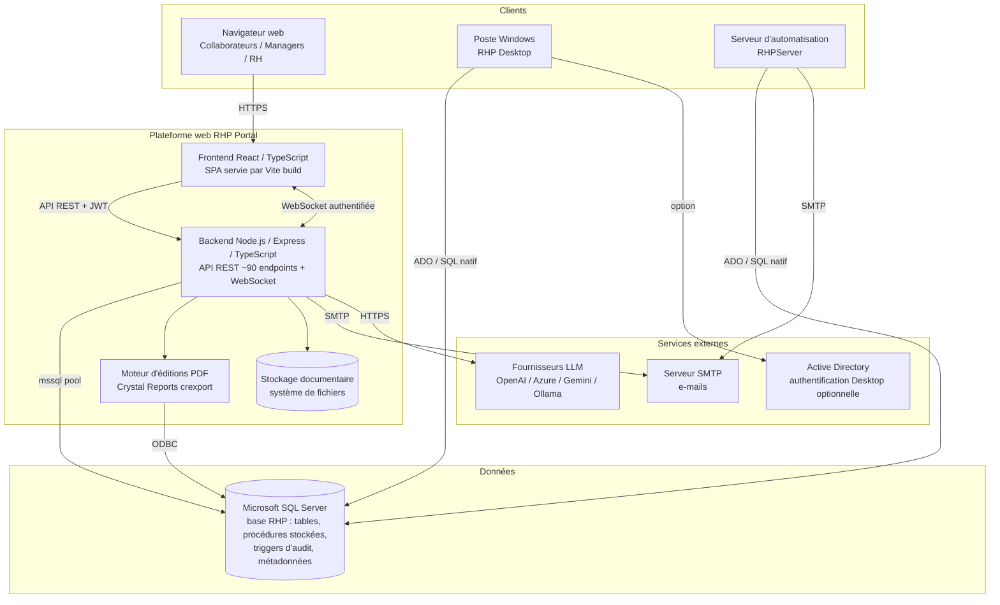
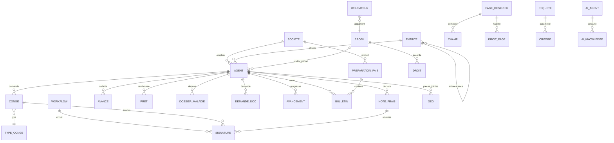
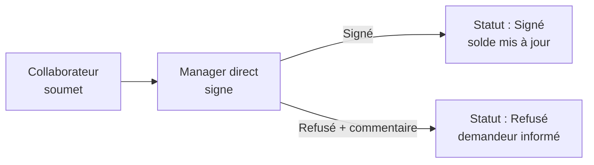
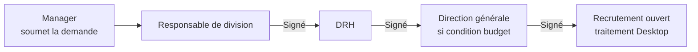
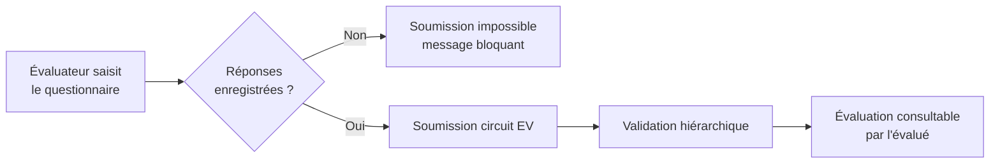
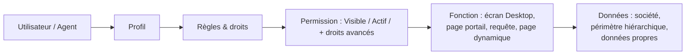

# RHP — Référentiel produit et technique pour la génération du site web

> **Nature de ce document.** Ce document est la **source de vérité fonctionnelle, technique et marketing** de la solution RHP. Il est destiné à alimenter un générateur de site web (IA ou équipe de conception) afin de produire un site vitrine professionnel, riche et exact. Chaque affirmation relative à une fonctionnalité s'appuie sur l'existant du produit (code source RHP Desktop et RHP Portal). Les informations non vérifiables sont explicitement marquées **« À confirmer »**, les pistes d'évolution **« Fonctionnalité potentielle »** et les conseils **« Recommandation »**.
>
> **Convention de nommage.** Dans ce document :
>
> - **RHP** désigne la solution globale ;
> - **RHP Desktop** désigne l'application métier Windows (back-office RH et paie) ;
> - **RHP Portal** désigne le portail web self-service (collaborateurs, managers, RH) ;
> - **RHPServer** désigne le service d'automatisation (notifications et envois planifiés).

---

## Table des matières

1. [Synthèse exécutive](#1-synthèse-exécutive)
2. [Vision globale de la solution](#2-vision-globale-de-la-solution)
3. [Cartographie fonctionnelle](#3-cartographie-fonctionnelle)
4. [Fonctionnalités RHP Desktop](#4-fonctionnalités-rhp-desktop)
5. [Fonctionnalités RHP Portal](#5-fonctionnalités-rhp-portal)
6. [Parcours utilisateurs](#6-parcours-utilisateurs)
7. [Exigences non fonctionnelles](#7-exigences-non-fonctionnelles)
8. [Architecture fonctionnelle et technique](#8-architecture-fonctionnelle-et-technique)
9. [Stack technologique](#9-stack-technologique)
10. [Modèle de données](#10-modèle-de-données)
11. [Workflow et moteur de validation](#11-workflow-et-moteur-de-validation)
12. [Sécurité et gestion des accès](#12-sécurité-et-gestion-des-accès)
13. [Multi-société et multi-tenant](#13-multi-société-et-multi-tenant)
14. [Authentification et SSO](#14-authentification-et-sso)
15. [Mode Desktop](#15-mode-desktop)
16. [Intégrations et API](#16-intégrations-et-api)
17. [Conformité et réglementation](#17-conformité-et-réglementation)
18. [RGPD / données personnelles](#18-rgpd--données-personnelles)
19. [KPI et indicateurs de performance](#19-kpi-et-indicateurs-de-performance)
20. [Reporting et tableaux de bord](#20-reporting-et-tableaux-de-bord)
21. [Maintenance et support](#21-maintenance-et-support)
22. [Cas d'usage métier](#22-cas-usage-métier)
23. [Positionnement commercial](#23-positionnement-commercial)
24. [Plan du futur site web](#24-plan-du-futur-site-web)
25. [Contenu de chaque page](#25-contenu-de-chaque-page)
26. [SEO](#26-seo)
27. [Captures d'écran et visuels](#27-captures-décran-et-visuels)
28. [Blocs de contenu pour le générateur de site](#28-blocs-de-contenu-pour-le-générateur-de-site)
29. [Annexe A — Conventions de rédaction](#29-annexe-a--conventions-de-rédaction)
30. [Annexe B — Glossaire](#30-annexe-b--glossaire)
31. [Annexe C — Éléments à confirmer (registre)](#31-annexe-c--éléments-à-confirmer-registre)

---

# 1. Synthèse exécutive

## 1.1 Présentation de RHP

**RHP est une solution intégrée de gestion des ressources humaines et de la paie (SIRH)** conçue pour les entreprises qui veulent fiabiliser leur administration du personnel, automatiser leurs processus RH et offrir à leurs collaborateurs un accès self-service moderne à leurs informations.

La solution repose sur **deux plateformes complémentaires** partageant une base de données unique :

- **RHP Desktop**, l'application métier Windows utilisée par les équipes RH, paie et administration. C'est le cœur du système : paramétrage, dossiers du personnel, moteur de paie complet, déclarations légales, reporting, administration et sécurité.
- **RHP Portal**, le portail web self-service utilisé par les collaborateurs et les managers : demandes (congés, avances, prêts, notes de frais, documents administratifs…), consultations (bulletins de paie, soldes, planning, organigramme…), validations de workflows, tableaux de bord et assistant IA conversationnel.

RHP se positionne comme **la brique RH et paie du système d'information de l'entreprise**. Il prend en charge l'ensemble du cycle : de l'arrivée d'un collaborateur (recrutement, création du dossier, contrat) jusqu'à son départ (solde de tout compte, liquidation), en passant par la paie mensuelle, la gestion des temps et des absences, la formation, l'évaluation, la carrière et la communication interne.

Le produit intègre nativement les **spécificités réglementaires marocaines** : télédéclaration de l'IR au format SIMPL-IR (fichier XML norme 9421), télédéclaration et télépaiement CNSS via DamanCom (génération du fichier EDI), états CIMR (retraite complémentaire), AMO/mutuelles, ordres de virement bancaires de masse (formats SIMT).

### Les problèmes auxquels RHP répond

| Problème constaté en entreprise | Conséquence | Réponse RHP |
| ------------------------------- | ----------- | ----------- |
| Dossiers du personnel dispersés (classeurs, fichiers Excel, postes de travail individuels) | Données incohérentes, introuvables, risquées | Dossier salarié unique et centralisé, multi-société, avec historique complet |
| Paie calculée à la main ou sur tableur | Erreurs, reprises, stress mensuel, non-conformité | Moteur de paie paramétrable (rubriques, abaques, fonctions de calcul), simulation, clôture, bulletins édités |
| Déclarations CNSS / IR préparées manuellement | Risque d'erreur de format, pénalités, temps perdu | Génération native des fichiers DamanCom (EDI) et SIMPL-IR (XML) depuis les données de paie |
| Demandes des collaborateurs par papier, e-mail ou oral | Demandes perdues, pas de traçabilité, délais opaques | Demandes dématérialisées sur le portail avec circuit de validation électronique et statuts suivis |
| Managers sans visibilité sur leurs équipes | Décisions lentes, validation au feeling | Espace manager : planning des congés d'équipe, parapheur de validation, indicateurs |
| Accès aux bulletins de paie et documents RH par demande au service RH | Charge administrative permanente pour la DRH | Self-service : bulletins PDF téléchargeables, attestations, soldes en temps réel |
| Reporting RH construit à la main | Chiffres non fiables, non à jour | Requêteur intégré, tableaux de bord, widgets, exports Excel, éditions Crystal Reports |
| Accès non maîtrisés aux données sensibles | Risque de fuite et de non-conformité | Profils et droits par écran, par action, par société ; audit et journalisation |

## 1.2 Proposition de valeur

Pour chaque bénéfice : **le problème métier** et **la manière dont RHP y répond concrètement**.

### Centralisation des processus RH

- **Problème :** les informations RH vivent dans des outils hétérogènes (paie d'un côté, congés sur papier, dossiers en classeurs). Aucune vue unique du collaborateur.
- **Réponse RHP :** une base de données unique partagée par RHP Desktop et RHP Portal. La fiche agent (RHP Desktop) concentre identité, contrats, carrière, rémunération, congés, prêts, outillage, compétences. Le portail expose au collaborateur et à son manager la partie pertinente de ces mêmes données, en lecture ou en demande.

### Automatisation

- **Problème :** les tâches répétitives (calcul de paie, relances, envoi des bulletins, calcul des soldes) consomment l'essentiel du temps des équipes RH.
- **Réponse RHP :** moteur de paie paramétrable par formules (rubriques calculées), calcul automatique des durées de congé (jours ouvrables, jours fériés), envoi massif des bulletins par e-mail, notifications planifiées et mailings automatiques exécutés par RHPServer, notifications de workflow temps réel sur le portail.

### Réduction des tâches administratives

- **Problème :** le service RH répond toute la journée à des sollicitations simples (solde de congé, bulletin perdu, attestation de travail).
- **Réponse RHP :** le portail self-service rend le collaborateur autonome : solde consultable à tout moment, bulletins PDF téléchargeables (avec protection par mot de passe possible), demandes de documents administratifs dématérialisées, attestations éditables depuis le Desktop.

### Fiabilisation des données

- **Problème :** doubles saisies, versions multiples du même chiffre, données contradictoires entre paie et administration.
- **Réponse RHP :** saisie unique, contrôles de cohérence à l'enregistrement (règles de validation configurables sur les pages portail, contrôles métier Desktop), verrouillage des documents en cours d'édition, contrôle de concurrence optimiste (rowversion), audit espion par triggers SQL traçant insertions, modifications et suppressions.

### Amélioration de l'expérience collaborateur

- **Problème :** les outils RH sont réservés au service RH ; le collaborateur n'a aucune visibilité.
- **Réponse RHP :** RHP Portal, application web moderne (React, Material Design), accessible depuis un navigateur, avec tableau de bord personnalisable (widgets, raccourcis), thème clair/sombre, affichage adapté aux mobiles, et un assistant IA conversationnel capable de répondre en langage naturel (« Quel est mon solde de congé ? », « Où en est ma note de frais ? »).

### Optimisation des workflows

- **Problème :** les validations circulent par e-mail ou papier ; impossible de savoir qui doit signer et où en est un dossier.
- **Réponse RHP :** moteur de workflow de signatures configurable par type de document (congés, notes de frais, avances, prêts, recrutement…), circuits multi-signataires avec conditions, parapheur de validation, suppléants (délégation), statuts normalisés et historique des décisions avec commentaires.

### Traçabilité

- **Problème :** en cas de litige ou de contrôle, impossible de reconstituer qui a fait quoi et quand.
- **Réponse RHP :** chaque demande porte un statut horodaté et un historique de signatures (décision, date, commentaire) ; l'audit espion journalise les modifications en base ; les connexions portail sont tracées ; les éditions et exports sont datés.

### Accès sécurisé aux informations

- **Problème :** données de paie et données personnelles exposées (fichiers partagés, mots de passe faibles, accès non cloisonnés).
- **Réponse RHP :** authentification par e-mail et mot de passe chiffré (AES-256), sessions JWT à durée limitée (15 min) avec renouvellement transparent, profils de droits par écran et par action, cloisonnement multi-société systématique, limitation stricte des données visibles (un collaborateur ne voit que ses données ; un manager celles de son équipe), chiffrement TLS en production.

## 1.3 Utilisateurs cibles

| Profil | Besoins | Fonctionnalités principales dans RHP | Valeur obtenue |
| ------ | ------- | ------------------------------------ | -------------- |
| **Direction des ressources humaines** | Piloter l'activité RH, fiabiliser la conformité, réduire l'administratif | Supervision des processus (Desktop), déclarations légales, tableaux de bord, requêteur, workflow, GPEC, formation, recrutement | Une DRH concentrée sur l'humain plutôt que sur la paperasse ; conformité IR/CNSS maîtrisée |
| **Gestionnaires RH / gestionnaires de paie** | Produire la paie juste et à l'heure, tenir les dossiers à jour | Préparation et clôture de paie, rubriques et abaques, simulation, bulletins, avances, prêts, congés, maladie, notes de frais, imports Excel, déclarations | Un cycle de paie maîtrisé, des dossiers complets, moins de reprises manuelles |
| **Responsables paie** | Calculs fiables, éditions, virements, déclarations | Moteur de paie par formules, calcul inverse net→brut, virements SIMT, livre et journal de paie, SIMPL-IR, DamanCom, CIMR | Sécurisation du processus de bout en bout, de la préparation au virement |
| **Managers / responsables de service** | Valider vite, suivre l'équipe, anticiper les absences | Portail : parapheur (validation des demandes), planning des congés d'équipe, fiche équipe, évaluations, widgets d'absentéisme | Décisions rapides et tracées, visibilité temps réel sur l'équipe |
| **Collaborateurs** | Accéder à leurs informations, faire des demandes sans paperasse | Portail : demandes (congé, avance, prêt, note de frais, document administratif), bulletins PDF, soldes, fiche agent, planning, assistant IA | Autonomie totale, transparence, délais visibles |
| **Direction financière** | Maîtriser la masse salariale, la provision congés, les frais | Éditions de paie, provision des congés, suivi des notes de frais et avances, pièces comptables de paie, exports Excel | Chiffres fiables et exploitables, produits sans re-saisie |
| **Direction générale** | Indicateurs consolidés, effectifs, coûts, climat social | Tableaux de bord portail (widgets), requêtes de consultation (effectif, départs à la retraite, soldes), communication interne | Pilotage à partir de données à jour, sans solliciter la DRH |
| **Administrateurs système / DSI** | Sécurité, déploiement, intégration, supervision | Profils et droits (écrans, actions, sociétés), authentification Active Directory côté Desktop, audit, licence, RHPServer, API REST du portail, logs | Un SIRH administrable, auditable et intégrable au SI existant |

# 2. Vision globale de la solution

RHP est un **système à deux faces sur une donnée unique** :

```mermaid
flowchart LR
    subgraph Collaborateurs & Managers
        P[RHP Portal<br/>Navigateur web]
    end
    subgraph Equipes RH / Paie / Admin
        D[RHP Desktop<br/>Application Windows]
        S[RHPServer<br/>Notifications & envois planifiés]
    end
    DB[(Base de données unique<br/>Microsoft SQL Server)]
    P <-->|API REST sécurisée (JWT)| API[Backend RHP Portal<br/>Node.js / Express]
    API <--> DB
    D <-->|Connexion SQL directe| DB
    S <-->|Connexion SQL directe| DB
```

## 2.1 RHP Desktop — le back-office métier

Application Windows (WinForms) destinée aux équipes qui **produisent et administrent** la donnée RH :

- équipes RH (dossiers du personnel, contrats, carrière, discipline) ;
- gestionnaires et responsables paie (moteur de paie, bulletins, virements, déclarations) ;
- administrateurs (paramétrage, sécurité, droits, requêteur, licence).

C'est dans RHP Desktop que se font : le paramétrage complet (sociétés, rubriques de paie, plans de paie, jours fériés, circuits de signature), la préparation et la clôture de la paie, les déclarations fiscales et sociales, les éditions réglementaires, l'import de données, l'audit et l'administration des accès.

## 2.2 RHP Portal — le self-service web

Portail web (navigateur, sans installation) destiné aux **utilisateurs finaux** :

- **accès collaborateur** : tableau de bord personnel, fiche agent en consultation, demandes dématérialisées (congé, avance, prêt, note de frais, dossier maladie, document administratif, accident de travail), consultation des bulletins de paie et des soldes, planning des congés, agenda, fiche de poste, organigramme, chronologie de carrière, blog de communication RH ;
- **accès manager** : parapheur de validation (signer / refuser avec commentaire), planning des congés de l'équipe, widgets d'équipe, délégation de signature ;
- **demandes RH et validations** : circuit de signature électronique intégré à chaque type de demande ;
- **consultations** : pages de consultation construites à partir du requêteur Desktop (soldes de congés, départs à la retraite, etc.) et pages dynamiques conçues dans le Designer de pages (SP_Page_Designer) sans développement ;
- **partage documentaire** : pièces jointes (GED) sur les demandes, documents mis à disposition, éditions PDF.

## 2.3 Tableau comparatif

| Fonction | RHP Desktop | RHP Portal | Profil utilisateur |
| -------- | ----------- | ---------- | ------------------ |
| Paramétrage sociétés, rubriques, plans de paie | **Oui (exclusif)** | Non | Responsable paie, admin |
| Préparation, calcul et clôture de la paie | **Oui (exclusif)** | Non | Gestionnaire paie |
| Édition et envoi massif des bulletins | **Oui (exclusif)** | Non | Gestionnaire paie |
| Déclarations IR (SIMPL-IR) et CNSS (DamanCom) | **Oui (exclusif)** | Non | Responsable paie |
| Création et administration complète du dossier salarié | **Oui (exclusif)** | Consultation partielle (sa propre fiche) | Gestionnaire RH |
| Gestion des contrats, carrière, avancements | **Oui (exclusif)** | Consultation (chronologie de carrière) | Gestionnaire RH |
| Saisie d'une demande de congé / avance / prêt / note de frais | Oui (saisie pour le compte d'un agent) | **Oui (self-service)** | Collaborateur, RH |
| Validation des demandes (workflow) | Oui (écran de signatures) | **Oui (parapheur, temps réel)** | Manager |
| Consultation des bulletins de paie | Oui (tous les agents) | **Oui (ses propres bulletins, PDF)** | Collaborateur |
| Consultation des soldes de congés | Oui | **Oui (temps réel)** | Collaborateur |
| Planning des congés | Oui (planning global, tous services) | **Oui (soi + son équipe si manager)** | Manager, RH |
| Recrutement (demandes, CVthèque, entretiens) | **Oui (exclusif)** | Demande de recrutement (dépôt + suivi) | RH, manager |
| Formation (catalogue, sessions, financement) | **Oui (exclusif)** | Consultation, évaluation à chaud | RH, collaborateur |
| Évaluations et enquêtes | Paramétrage des questionnaires | **Saisie des réponses** | RH, évaluateurs |
| GED / pièces jointes | Oui (explorateur documentaire) | **Oui (pièces jointes sur les demandes)** | Tous |
| Requêteur (création de requêtes) | **Oui (exclusif)** | Exécution des requêtes publiées | Admin RH, dirigeants |
| Tableaux de bord widgets | Configuration des widgets (via requêteur) | **Oui (dashboard personnalisable)** | Tous |
| Designer de pages portail (création sans code) | **Oui (exclusif — SP_Page_Designer)** | Exécution des pages créées | Admin fonctionnel |
| Assistant IA (configuration modèles LLM) | **Oui (exclusif — AI_Modeles)** | **Oui (chat conversationnel)** | Admin, tous utilisateurs |
| Sécurité, profils, droits, audit | **Oui (exclusif)** | Application des droits | Admin |
| Notifications et mailings planifiés | Paramétrage + RHPServer | Réception (badge signatures) | Admin, managers |

### Fonctions exclusives Desktop

Tout ce qui est **production et administration** : moteur de paie, déclarations légales, paramétrage, création de dossiers, requêteur (création), Designer de pages, configuration IA, sécurité, audit, licence, imports/exports de masse, éditions Crystal.

### Fonctions exclusives Portal

Tout ce qui est **expérience self-service** : tableau de bord personnalisable (widgets en glisser-déposer), chat de l'assistant IA, badge temps réel des documents à signer, parapheur web, consultation mobile, blog de communication RH.

### Fonctions partagées

Les **demandes et le workflow** : une demande peut être saisie côté portail par le collaborateur (ou côté Desktop par un gestionnaire), puis validée depuis le parapheur du portail ou depuis l'écran de signatures du Desktop. Les deux plateformes écrivent dans les mêmes tables et respectent les mêmes circuits.

### Interactions entre les deux plateformes

- **Base unique** : aucune synchronisation à prévoir ; le portail lit et écrit directement dans la base RHP via son API.
- **Même moteur de workflow** : la soumission d'une demande (portail ou Desktop) alimente le même circuit de signatures ; le statut est visible partout.
- **Même sécurité** : les profils sont définis dans le Desktop (Admin_Profile) ; le portail les applique au login et les réévalue à chaque renouvellement de session.
- **Pages portail conçues dans le Desktop** : le Designer de pages (SP_Page_Designer, écran Desktop) permet de créer des formulaires métier (tables, champs, validations, habilitations, circuit de signature) qui sont immédiatement exécutés par le portail — **sans développement web**.
- **Requêtes Desktop publiées sur le portail** : une requête du requêteur peut devenir une page de consultation du menu portail ou un widget de tableau de bord en cochant une option dans le Desktop.
- **Version alignée** : le portail vérifie au login que sa version applicative correspond à la version attendue en base (évite les désynchronisations après une mise à jour).

---

# 3. Cartographie fonctionnelle

RHP couvre les domaines fonctionnels suivants. Chaque module est documenté selon la trame : objectif métier, utilisateurs, fonctionnalités, workflow, données, règles métier, interactions, valeur entreprise, valeur utilisateur, exemple, illustration.

## 3.1 Administration du personnel (dossier salarié)

**Objectif métier.** Disposer d'un dossier unique, complet et à jour pour chaque collaborateur, tout au long de sa vie dans l'entreprise.

**Utilisateurs concernés.** Gestionnaires RH (saisie et maintenance sur Desktop) ; collaborateurs et managers (consultation sur Portal).

**Fonctionnalités principales.**

- Fiche agent multi-onglets : identité, coordonnées, situation familiale, affectation organisationnelle (société, établissement, entité, poste, grade), paramètres de paie, banque, compétences, CV (formations et expériences), outillage détenu, éléments de paie récurrents.
- Liste des agents avec recherche et zooms paramétrés.
- Historique des affectations et évolutions de carrière.
- Attestations (travail, salaire) et contrat édités en PDF via Crystal Reports, dont une version arabe de l'attestation de travail.
- Import de masse des agents (Excel) avec affectation des champs.
- Bloc « Paramétrage de l'authentification au portail » : affectation d'un profil portail à l'agent.

**Workflow utilisateur.** Création de l'agent (manuellement ou par import) → complétion des onglets → affectation organisationnelle → l'agent devient visible dans toute la solution (paie, congés, portail) → au login du portail, son profil est résolu automatiquement.

**Données manipulées.** Table agent (matricule, identité, dates, affectations, coordonnées bancaires), tables organisationnelles (société, entité, poste, grade), famille, compétences, formations, expériences.

**Règles métier importantes.** Le matricule est l'identifiant pivot de tout le système ; toute donnée (congé, paie, demande) est rattachée à un matricule et à une société ; un agent inactif ne peut plus se connecter au portail.

**Interactions.** Module pivot : alimente la paie, les congés, le workflow (signataires), l'organigramme, le portail (authentification), la GPEC, la formation, le recrutement.

**Valeur entreprise.** Fin des dossiers dispersés ; une seule saisie, réutilisée partout ; historique complet en cas de contrôle.

**Valeur utilisateur.** Le gestionnaire retrouve tout en un écran ; le collaborateur consulte sa propre fiche sans solliciter la DRH.

**Exemple concret.** À l'arrivée d'un nouveau commercial, la gestionnaire crée la fiche (import ou saisie), renseigne l'affectation et la banque ; le mois suivant, l'agent est payé sans re-saisie et se connecte au portail pour télécharger son premier bulletin.

> **Illustration suggérée :**
> Capture de la fiche agent RHP Desktop (écran `RH_Agent`) montrant les onglets et le bloc d'affectation.
>
> **Éléments visibles :** matricule, identité, photo, onglets (affectation, paie, famille, compétences…), barre d'actions.
>
> **Message marketing associé :** « Un dossier unique pour chaque collaborateur, du recrutement au départ. »

## 3.2 Organisation et structure

**Objectif métier.** Modéliser l'organisation réelle (sociétés, établissements, entités, postes, grades, liens hiérarchiques) et la rendre visible.

**Utilisateurs.** Gestionnaires RH (Desktop), tous les utilisateurs (consultation organigramme sur Portal).

**Fonctionnalités.** Organigramme graphique (Desktop `Org_Organigramme` et portail avec photos des responsables) ; gestion des postes et fiches de poste (descriptif consultable par l'agent sur le portail) ; grades ; affectations RH ; promotions et avancements avec frise chronologique (`RH_Avancement_Timeline`, visible aussi sur le portail) ; affectation analytique (plan analytique comptable).

**Workflow.** Paramétrage de l'arborescence → affectation des agents → tout agent rattaché à une entité hérite de la chaîne hiérarchique (utilisée pour les droits manager et le workflow).

**Données.** Entités (arborescence avec racine), postes, grades, affectations, avancements.

**Règles métier.** Le statut « manager » (TeamLeader) du portail est dérivé de la responsabilité d'entité : un responsable voit les données de toute sa branche hiérarchique ; les promotions validées alimentent la chronologie de carrière.

**Interactions.** Pilote les droits managers du portail, les circuits de signature, l'affectation analytique de la paie.

**Valeur entreprise.** Une organisation explicite, qui fait fonctionner droits et workflows sans re-paramétrage.

**Valeur utilisateur.** Chacun visualise qui fait quoi et qui valide ses demandes.

**Exemple.** Une réorganisation déplace l'équipe « Support » sous la direction « Expérience client » : l'organigramme, les droits managers et le planning des congés d'équipe suivent automatiquement.

> **Illustration suggérée :** capture de l'organigramme portail (nœuds avec photos).
> **Message marketing :** « Votre organigramme vivant, directement issu de vos données RH. »

## 3.3 Paie

Voir le détail complet en [section 4.3](#43-paie--cœur-de-rhp-desktop). Résumé : moteur de paie paramétrable par rubriques et formules, préparation en mode classique ou journal, simulation, calcul inverse net→brut, clôture, bulletins Crystal, livre et journal de paie, envoi massif des bulletins par e-mail, virements bancaires de masse (SIMT), pièces comptables.

## 3.4 Temps, absences et congés

**Objectif métier.** Gérer les droits à congés, les demandes, les soldes et le planning, en appliquant les règles de l'entreprise.

**Utilisateurs.** Collaborateurs (demandes sur Portal), managers (validation, planning d'équipe), RH (paramétrage, provision, suivi global sur Desktop).

**Fonctionnalités.**

- Demande de congé sur le portail : choix du type, période, calcul automatique de la durée en jours ouvrables selon le calendrier de la société (jours ouvrables paramétrés + jours fériés), découpe par période de paie, contrôles de cohérence (chevauchements, droits).
- Soldes calculés par procédure dédiée (droits, consommés, restants) visibles en temps réel (portail et Desktop).
- Planning des congés : vue calendrier mensuelle — soi et son équipe pour un manager ; planning global avec une colonne par agent côté Desktop.
- Provision des congés côté Desktop (calcul et édition de la provision, import d'éléments variables).
- Demande de congé saisissable aussi par le gestionnaire RH sur Desktop (`RH_Demande_Conge`).

**Workflow.** Demande → contrôles automatiques → soumission au circuit de signature (type C) → validation manager → notification → mise à jour du solde et visibilité sur le planning.

**Données.** Suivi des congés (entête + détail), types de congés, calendrier société (jours ouvrables), jours fériés, soldes.

**Règles métier.** Durées en jours ouvrables ; exclusion automatique des jours fériés ; refus de chevauchement ; statut figé après validation/clôture ; la paie en cours peut verrouiller les saisies.

**Interactions.** Workflow, paie (absences et provisions), planning, widgets d'absentéisme.

**Valeur entreprise.** Absences maîtrisées, droits calculés de façon homogène, provision fiable pour la finance.

**Valeur utilisateur.** Une demande en 1 minute, un solde toujours à jour, une réponse tracée.

**Exemple.** Une collaboratrice pose 5 jours : le portail calcule 5 jours ouvrables (un jour férié est exclu), son manager valide depuis son téléphone, son solde passe immédiatement de 18 à 13 jours.

> **Illustration suggérée :** capture du planning des congés portail (vue mensuelle colorée) et de la carte « Solde de congé » du tableau de bord.
> **Message marketing :** « Les congés sans fichier Excel : demande, validation, solde — tout est en ligne. »

## 3.5 Frais, avances et prêts

**Objectif métier.** Dématérialiser la gestion des notes de frais, des avances sur salaire et des prêts au personnel, de la demande au remboursement.

**Utilisateurs.** Collaborateurs (Portal), managers (validation), RH/paie (règlement, intégration paie sur Desktop).

**Fonctionnalités.**

- **Notes de frais** : saisie portail avec lignes de détail, pièces jointes (GED), soumission au circuit (type NF), suivi des statuts ; côté Desktop, traitement et édition `NoteFrais.rpt`.
- **Avances sur salaire** : demande portail avec consultation des montants en cours, circuit AV, saisie massive possible côté Desktop (`Saisie_Massive_Avances`), liquidation via l'écran de paiement (`RH_Paiement`).
- **Prêts** : demande portail (circuit DP), suivi des prêts et échéancier côté Desktop (`RH_Pret`), remboursement intégré aux éléments de paie.

**Workflow.** Demande → validation → règlement/intégration en paie → suivi du remboursement jusqu'à soldage.

**Données.** Notes de frais (entête/détail), avances, demandes de prêt, prêts, échéances.

**Règles métier.** Montants en cours consultables avant nouvelle demande ; intégration des remboursements à la paie ; traçabilité par statut.

**Interactions.** Paie (retenues), workflow, GED, widgets (prêts et avances en attente).

**Valeur entreprise.** Contrôle des engagements financiers du personnel, remboursements automatisés.

**Valeur utilisateur.** Fin des bordereaux papier ; un justificatif photographié suffit.

**Exemple.** Un technicien photographie ses factures d'hôtel, saisit sa note de frais le soir même ; son responsable valide ; le remboursement arrive avec la paie du mois.

> **Illustration suggérée :** capture d'une note de frais portail avec ses lignes et le bouton « Pièces jointes ».
> **Message marketing :** « Note de frais : 2 minutes pour la saisir, zéro papier. »

## 3.6 Demandes RH et administratives

**Objectif métier.** Couvrir les demandes hors congés et frais : documents administratifs (attestations), dossiers maladie (remboursements de frais médicaux), déclarations d'accidents du travail, ordres de mission, prêts d'outillage.

**Utilisateurs.** Collaborateurs (Portal), RH (Desktop).

**Fonctionnalités.** Demande de document administratif (circuit DD) ; dossier maladie avec remboursements intégrés au moteur de paie (circuit DM) ; déclaration d'accident du travail (saisie Desktop, consultation portail) ; ordre de mission (Desktop) ; mouvements d'outillage — prêt et retour de matériel (circuit OTM, suivi de l'outillage détenu par agent).

**Workflow.** Demande → circuit de signature dédié → traitement RH → le document demandé est produit (attestation PDF) ou le remboursement passe en paie.

**Données.** Demandes de documents, dossiers maladie, déclarations AT, outillage et mouvements.

**Règles métier.** Chaque type de demande a son circuit configurable ; l'outillage détenu est rattaché à la fiche agent.

**Interactions.** Workflow, paie (remboursements maladie), fiche agent.

**Valeur entreprise.** Toutes les demandes RH dans un seul canal, mesurable et traçable.

**Valeur utilisateur.** Une attestation de travail demandée en ligne, sans appel ni déplacement.

**Exemple.** Un salarié demande une attestation de salaire pour son dossier bancaire ; la RH la génère en PDF le jour même.

> **Illustration suggérée :** capture de la liste « Mes demandes » du portail avec les statuts.
> **Message marketing :** « Toutes vos demandes RH, un seul point d'entrée. »

## 3.7 Gestion disciplinaire

**Objectif métier.** Tracer les événements disciplinaires (avertissements, sanctions) de manière encadrée.

**Utilisateurs.** RH (saisie Desktop), collaborateurs (consultation de leurs sanctions sur Portal).

**Fonctionnalités.** Liste et fiche disciplinaire (`RH_Discipline`), consultation portail en lecture seule.

**Règles métier.** Données sensibles : visibilité limitée à l'agent concerné et aux profils autorisés.

**Valeur.** Traçabilité juridique, transparence individuelle.

## 3.8 Carrière, compétences et GPEC

**Objectif métier.** Piloter les parcours : promotions, avancements, compétences, adéquation poste/profil.

**Fonctionnalités.** Promotions et avancements avec validation et frise chronologique ; registre de compétences par domaines ; adéquation poste/profil (GPEC) ; échelle de compétences visible sur la fiche agent portail.

**Valeur.** Une gestion prévisionnelle des emplois et compétences appuyée sur les données réelles.

## 3.9 Formation et évaluation

**Objectif métier.** Gérer le plan de formation (actions, sessions, cabinets, financement) et les évaluations (campagnes, questionnaires, évaluation à chaud des formations).

**Fonctionnalités.**

- Formation côté Desktop : types, cabinets, actions de formation avec modules, financement et participants, évaluation.
- Formation côté Portal : consultation de ses formations, évaluation à chaud en ligne.
- Moteur d'enquêtes/questionnaires (`Survey`) : concepteur de questionnaires (questions à choix, grilles, paragraphes, patterns), notation (scoring), rendu web sur le portail — utilisé pour les évaluations de formation et les évaluations annuelles.
- Évaluations : campagnes avec évaluateur/évalué, statuts, signature du type EV (une évaluation ne peut être signée que si des réponses existent).

**Valeur.** Plan de formation maîtrisé, évaluations dématérialisées avec traçabilité.

## 3.10 Recrutement

**Objectif métier.** Structurer le processus de recrutement, de l'expression du besoin à l'entretien.

**Fonctionnalités.** Demande de recrutement (saisie portail par un manager, circuit DR ; gestion complète Desktop), CVthèque, gestion des candidatures et entretiens (Desktop).

**Valeur.** Le besoin est validé avant tout engagement ; les candidatures sont centralisées.

## 3.11 Communication RH

**Objectif métier.** Diffuser l'information interne (actualités, notes de service).

**Fonctionnalités.** Blog de communication (création côté Desktop, lecture sur le portail avec remontée sur le tableau de bord).

**Valeur.** Un canal officiel, visible dès la page d'accueil du portail.

## 3.12 Déclarations fiscales et sociales (Maroc)

**Objectif métier.** Produire les déclarations légales à partir des données de paie, sans retraitement manuel.

**Fonctionnalités (Desktop exclusif).**

- **SIMPL-IR** : génération du fichier XML de télédéclaration de l'IR (norme 9421) avec les sous-états : permanents, exonérés, permanents exonérés, doctorants, occasionnels, stagiaires, bénéficiaires.
- **DamanCom (CNSS)** : génération du fichier EDI à enregistrements fixes (B00/B01/B02…) pour la télédéclaration et le télépaiement CNSS, avec import de retour.
- **CIMR** : état de la retraite complémentaire.
- **AMO / mutuelles** : états dédiés.
- **Virements** : ordres de virement de masse aux formats bancaires marocains (SIMT).

**Règles métier.** Fonctionnalités soumises à options de licence (DamanCom, Simpl-IR) ; génération à partir des préparations de paie clôturées.

**Valeur.** Conformité sans double saisie ni risque de format.

## 3.13 GED et documents

**Objectif métier.** Attacher et organiser les documents relatifs aux agents et aux demandes.

**Fonctionnalités.** Pièces jointes génériques greffables sur tout écran Desktop ; explorateur documentaire (`TC_GED`) avec arborescence de dossiers ; GED du portail (upload, téléchargement, renommage, suppression, dossiers, droits d'écriture et de masquage par utilisateur, 50 Mo maximum par fichier, contrôle du type MIME) ; GED activable par page dynamique avec catégories et caractère obligatoire.

**Valeur.** Les justificatifs sont attachés à la demande, pas dans une boîte mail.

## 3.14 Workflow et signatures électroniques

Voir [section 11](#11-workflow-et-moteur-de-validation). Résumé : circuits de signature configurables par type de document, multi-signataires, conditions, suppléants, parapheur, statuts normalisés, historique commenté.

## 3.15 Reporting, requêteur et tableaux de bord

Voir [section 20](#20-reporting-et-tableaux-de-bord). Résumé : requêteur visuel (création Desktop), publication sur le portail comme page de consultation ou widget, dashboards personnalisables, éditions Crystal Reports, exports Excel.

## 3.16 Designer de pages portail (SP_Page_Designer)

**Objectif métier.** Permettre à un administrateur fonctionnel de **créer de nouvelles pages métier pour le portail sans développement** : tables de données générées, formulaires, validations, habilitations, circuit de signature, GED.

**Fonctionnalités.** Conception dans le Desktop (entête + grilles, 14 types de champs, 13 types de règles de validation, formules déclaratives, droits par profil sur 7 habilitations, publication avec statut BROUILLON/PUBLIÉ/DÉSACTIVÉ/ARCHIVÉ) ; exécution par le moteur de pages dynamiques du portail (rendu automatique du formulaire et de la liste, contrôles, calculs, soumission workflow, impression).

**Exemple livré.** Page « Frais kilométriques » (FKM) fournie comme modèle de référence.

**Valeur.** Le SIRH s'étend aux processus spécifiques de l'entreprise (demandes internes, formulaires) sans projet de développement.

## 3.17 Assistant IA

**Objectif métier.** Répondre aux questions des utilisateurs et exécuter des consultations en langage naturel.

**Fonctionnalités.** Chat flottant intégré au portail ; interprétation de l'intention (question de connaissance vs action) ; réponses adossées aux données réelles de l'utilisateur (congés, bulletins, notes de frais, organigramme, agenda…) via une vingtaine d'outils sécurisés ; base de connaissances documentaire (import de documents, découpage en extraits, recherche par similarité — RAG) ; configuration multi-modèles dans le Desktop (plusieurs fournisseurs LLM : OpenAI et compatibles, Azure OpenAI, Google Gemini, Ollama local ; modèle par défaut par société ou global).

**Règles métier.** L'assistant n'accède qu'aux données autorisées par le contexte de l'utilisateur connecté (mêmes cloisonnements que le portail) ; les sources documentaires utilisées sont citées.

**Valeur.** Le portail devient conversationnel : « Combien de jours de congé me reste-t-il ? » obtient une réponse immédiate, sans navigation.

## 3.18 Administration, sécurité et exploitation

**Objectif métier.** Administrer la solution : utilisateurs, profils, droits, audit, notifications, licence, supervision.

**Fonctionnalités.** Utilisateurs et profils ; droits par écran et par action (y compris droits avancés par contrôle) ; profils portail des agents ; authentification Active Directory (Desktop) ; audit espion (triggers de journalisation) ; superviseur de sessions ; notifications paramétrées par requêtes SQL exécutées par RHPServer ; mailings et abonnements planifiés ; gestion de licence par options et limites (sociétés, utilisateurs, effectif).

# 4. Fonctionnalités RHP Desktop

Cette section documente les domaines fonctionnels de RHP Desktop tels qu'ils existent réellement dans l'application (organisation réelle du menu : **Gestion administrative et Paie · Organisation et Données RH · Paramétrages et importations · Système**). Chaque domaine suit la trame : description, objectif, utilisateur, workflow, données, règles métier, dépendances, résultats, cas d'utilisation, illustration.

## 4.1 Gestion des collaborateurs et dossiers salariés

1. **Description.** Fiche agent complète (identité, famille, affectation, paie, banque, compétences, CV, outillage), liste des agents, import Excel, éditions d'attestations et contrats.
2. **Objectif.** Centraliser le dossier salarié et fiabiliser la donnée pivot du SIRH.
3. **Utilisateur.** Gestionnaire RH, gestionnaire paie.
4. **Workflow.** Création/import → complétion des onglets → affectation organisationnelle → disponibilité dans tous les modules → archivage à la sortie.
5. **Données.** Agents (matricule pivot), famille, formations, expériences, compétences, affectations, coordonnées bancaires.
6. **Règles métier.** Matricule unique par société ; l'agent inactif ne se connecte plus au portail ; les affectations sont historisées ; l'authentification portail est paramétrée depuis la fiche (profil portail).
7. **Dépendances.** Paramétrage organisationnel (sociétés, entités, postes, grades).
8. **Résultats.** Dossier unique à jour ; agents payables dès le premier mois sans re-saisie.
9. **Cas d'utilisation.** Embauche de 15 saisonniers : import Excel avec affectation des colonnes, contrôle, création en masse.
10. **Illustration.** Capture `RH_Agent` (fiche multi-onglets) + `RH_Agent_Liste`.

## 4.2 Organisation, contrats et éléments administratifs

1. **Description.** Organigramme, postes et fiches de poste, grades, affectations, promotions et avancements (avec frise chronologique), affectation analytique, éditions administratives (contrat, attestations).
2. **Objectif.** Modéliser l'organisation et produire les documents administratifs courants.
3. **Utilisateur.** Gestionnaire RH.
4. **Workflow.** Paramétrage de la structure → affectation → évolutions (avancements validés) → édition des documents au besoin.
5. **Données.** Entités arborescentes, postes, grades, avancements, plan analytique.
6. **Règles métier.** La responsabilité d'entité détermine les droits manager du portail ; les avancements validés alimentent la chronologie de carrière.
7. **Dépendances.** Fiche agent.
8. **Résultats.** Organisation explicite réutilisée par les droits et workflows ; documents produits en quelques clics.
9. **Cas d'utilisation.** Campagne d'avancements : proposition, validation, effet en paie et publication de la nouvelle frise de carrière.
10. **Illustration.** Capture organigramme Desktop + `RH_Avancement_Timeline`.

## 4.3 Paie — cœur de RHP Desktop

### 4.3.1 Paramétrage de la paie

1. **Description.** Rubriques de paie avec formules de calcul, fonctions utilisateur, abaques (barèmes), plans de paie (profils de rubriques), modèles de bulletins, journaux de paie, périodes de paie, jours fériés, paramétrage des déclarations.
2. **Objectif.** Adapter le moteur à la convention collective et aux règles de l'entreprise, sans coder.
3. **Utilisateur.** Responsable paie / paramétreur.
4. **Workflow.** Définition des rubriques (base, taux, formule, conditions) → composition des plans de paie → affectation aux agents → test par simulation → mise en production.
5. **Données.** Rubriques, formules, abaques, plans de paie, périodes, jours fériés.
6. **Règles métier.** Les formules sont compilées et exécutées par un moteur de calcul dédié ; les rubriques sont copiables entre sociétés ; les abaques gèrent les barèmes progressifs (ex. IR).
7. **Dépendances.** Sociétés, agents.
8. **Résultats.** Une paie configurée aux règles de l'entreprise, reproductible chaque mois.
9. **Cas d'utilisation.** Création d'une prime d'ancienneté progressive par tranches via un abaque, appliquée automatiquement à tous les agents éligibles.
10. **Illustration.** Capture `RH_Parametrage_Rubrique_Paie` (grille des rubriques et formule).

### 4.3.2 Préparation et calcul de la paie

1. **Description.** Préparation de paie en deux modes : **mode classique** (saisie par agent) et **mode journal** (saisie en liste) ; saisie des éléments variables ; calcul ; contrôle ; imports d'éléments variables (Excel).
2. **Objectif.** Produire la paie mensuelle complète et contrôlée.
3. **Utilisateur.** Gestionnaire paie.
4. **Workflow.** Ouverture de la préparation sur la période → saisie/import des variables (absences, primes, retenues) → calcul → contrôle des anomalies → éditions de contrôle → clôture.
5. **Données.** Préparations de paie, éléments variables, rubriques calculées.
6. **Règles métier.** Une préparation clôturée n'est plus modifiable ; la paie en cours verrouille les saisies liées ; calcul inverse **net→brut** disponible (à partir d'un net souhaité).
7. **Dépendances.** Paramétrage de paie, agents, congés/absences, avances et prêts en cours.
8. **Résultats.** Bulletins calculés, livre et journal de paie, base des déclarations.
9. **Cas d'utilisation.** Paie de mars : import des variables par Excel, calcul de 400 bulletins, contrôle des écarts avec février, clôture.
10. **Illustration.** Capture `RH_Preparation_Paie` (grille de calcul) + écran de clôture.

### 4.3.3 Simulation et calculs

1. **Description.** Écran de simulation de paie (calcul hors production, scénarios) ; calcul inverse net→brut ; fonctions de calcul partagées.
2. **Objectif.** Répondre aux questions « combien coûterait… » sans toucher à la paie réelle.
3. **Utilisateur.** Responsable paie, DRH.
4. **Workflow.** Choix de l'agent et des hypothèses → calcul → analyse du bulletin simulé.
5. **Résultats.** Coût employeur et net simulés immédiatement.
6. **Cas d'utilisation.** Simulation d'une augmentation de 10 % pour arbitrage budgétaire.

### 4.3.4 Bulletins, virements et liquidation

1. **Description.** Édition des bulletins (modèles Crystal), **envoi massif des bulletins par e-mail**, livre de paie, journal de paie, ordres de virement de masse aux formats bancaires (SIMT), écran de paiement des salaires et avances (liquidation), pièce comptable de paie.
2. **Objectif.** Boucler le cycle : payer, documenter, comptabiliser.
3. **Utilisateur.** Gestionnaire paie, comptabilité.
4. **Workflow.** Clôture → édition/envoi des bulletins → génération du fichier de virement → règlement → pièce comptable.
5. **Résultats.** Salariés payés par virement de masse, bulletins distribués (portail + e-mail), charge comptable préparée.
6. **Cas d'utilisation.** Le 28 du mois : génération du fichier SIMT pour la banque, envoi des 400 bulletins par e-mail en un traitement.

### 4.3.5 Déclarations fiscales et sociales

1. **Description.** SIMPL-IR (XML norme 9421, 7 sous-états), DamanCom CNSS (fichier EDI + import de retour), CIMR, AMO/mutuelles.
2. **Objectif.** Produire les déclarations légales directement depuis la paie.
3. **Utilisateur.** Responsable paie.
4. **Workflow.** Sélection de la période/société → génération du fichier → dépôt sur la plateforme de l'administration → (DamanCom) import du retour.
5. **Règles métier.** Options de licence dédiées ; génération à partir des paies clôturées.
6. **Résultats.** Fichiers conformes, prêts à déposer.
7. **Illustration.** Capture de l'écran `IR_XML` / `Cnss_DamanCom`.

## 4.4 Absences, congés et suivi des droits

Couvert en [3.4](#34-temps-absences-et-congés). Spécificités Desktop : planning global (une colonne par agent), provision des congés (calcul et édition), import d'éléments variables de provision, types de congés et jours fériés paramétrables, saisie pour le compte d'un agent.

## 4.5 Notes de frais, avances et prêts

Couvert en [3.5](#35-frais-avances-et-prêts). Spécificités Desktop : saisie massive d'avances, écran de prêts avec échéancier, traitement des notes de frais validées, édition `NoteFrais.rpt`, intégration des retenues à la paie.

## 4.6 Demandes RH, maladie, accidents du travail, outillage

Couvert en [3.6](#36-demandes-rh-et-administratives). Spécificités Desktop : déclaration d'accident du travail, ordres de mission, gestion de l'outillage et de ses mouvements, dossiers maladie avec remboursements médicaux intégrés au moteur de paie.

## 4.7 Documents et GED

Couvert en [3.13](#313-ged-et-documents). Spécificités Desktop : explorateur documentaire `TC_GED`, pièces jointes greffables sur tout écran, lecteur réseau documentaire.

## 4.8 Formation, évaluation, enquêtes

Couvert en [3.9](#39-formation-et-évaluation). Spécificités Desktop : gestion complète du plan de formation (actions, modules, cabinets, financement, participants), concepteur de questionnaires, campagnes d'évaluation.

## 4.9 Recrutement

Couvert en [3.10](#310-recrutement). Spécificités Desktop : CVthèque, traitement des candidatures, entretiens.

## 4.10 GPEC

Couvert en [3.8](#38-carrière-compétences-et-gpec).

## 4.11 Communication RH

Couvert en [3.11](#311-communication-rh). Spécificité Desktop : rédaction et publication des articles du blog.

## 4.12 Reporting, requêteur et éditions

1. **Description.** **Requêteur intégré (`Param_Query`)** : création visuelle de requêtes avec critères saisissables, types de sortie (grille, graphique, traitement, export), PivotGrid, impression ; publication d'une requête comme page de consultation du portail ou widget de tableau de bord ; **éditions Crystal Reports** pilotées par modèles (critères, mot de passe, par société, exposition au portail) ; Microsoft ReportViewer en complément.
2. **Objectif.** Rendre la donnée exploitable sans développement et sans extraction manuelle.
3. **Utilisateur.** Admin fonctionnel, DRH, dirigeants (côté portail pour l'exécution).
4. **Workflow.** Création de la requête (Desktop) → définition des critères et de leur mode de saisie (zone libre, calendrier, case à cocher, zoom, liste déroulante) → test → publication (page portail ou widget).
5. **Données.** Définitions de requêtes et critères ; n'importe quelle table du SIRH.
6. **Règles métier.** Critères de contexte (société, utilisateur, agent connecté) alimentés automatiquement côté portail — jamais demandés à l'utilisateur ; sécurité par droit de visibilité sur la requête.
7. **Résultats.** Pages de consultation et indicateurs en libre-service, sécurisés.
8. **Cas d'utilisation.** Création d'une requête « Départs à la retraite à 24 mois » publiée au menu du portail pour la DRH.
9. **Illustration.** Capture du requêteur et d'une page de consultation portail résultante.

## 4.13 Designer de pages portail (SP_Page_Designer)

Couvert en [3.16](#316-designer-de-pages-portail-sp_page_designer). Le Designer est un écran Desktop : il génère les tables SQL, les métadonnées de page et les habilitations ; le portail exécute la page sans aucun déploiement web.

## 4.14 Workflow et signatures

Couvert en [section 11](#11-workflow-et-moteur-de-validation). Spécificités Desktop : définition des types de documents et des circuits (signataires, conditions, relations entre règles), écran de signatures, gestion des suppléants.

## 4.15 Assistant IA — configuration

Couvert en [3.17](#317-assistant-ia). Spécificités Desktop : écran `AI_Modeles` (multi-modèles, modèle par défaut, instruction commune), base de connaissances `AI_KnowledgeBase` (import de documents, chunks, embedding), configuration d'embedding.

## 4.16 Administration, sécurité, imports, exports, intégrations

1. **Description.** Utilisateurs, profils et droits (par écran, par action, avancés par contrôle) ; affectation des profils portail aux agents ; authentification Active Directory ; audit espion (génération de triggers et consultation du journal) ; superviseur de sessions ; console d'administration ; gestion des menus et écrans ; imports Excel (agents, éléments de paie, provision) ; exports (Excel, fichiers bancaires, EDI/XML) ; licence.
2. **Objectif.** Donner à la DSI et à l'administrateur fonctionnel le contrôle complet de la solution.
3. **Utilisateur.** Administrateur système, DSI.
4. **Workflow.** Définition des profils → affectation aux utilisateurs/agents → paramétrage des droits → supervision (sessions, audit).
5. **Données.** Utilisateurs, profils, droits, journal d'audit, sessions.
6. **Règles métier.** Profil « 1 » = administrateur (contournement) ; droit absent = fonction non contrôlée pour ce profil (déploiement progressif) ; licence par options (DamanCom, Simpl-IR, GED, organisation, analytique, web) et limites (sociétés, utilisateurs, tranches d'effectif).
7. **Résultats.** Sécurité administrable, traçabilité, conformité d'exploitation.
8. **Illustration.** Capture `Admin_Profile` (onglets desktop et portail).

---

# 5. Fonctionnalités RHP Portal

Cette section détaille l'expérience utilisateur du portail. Pour chaque fonctionnalité : parcours, écrans, actions, validations, notifications, statuts, permissions, erreurs possibles, expérience mobile.

## 5.1 Connexion et espace personnel

- **Parcours.** L'utilisateur saisit e-mail et mot de passe (option « Se souvenir de moi ») → vérification de la version de l'application → chargement de son contexte (agent, société, profil, menus autorisés) → arrivée sur le tableau de bord.
- **Écrans.** `Login`, boîte de changement de mot de passe, `Dashboard`.
- **Actions.** Connexion, mot de passe oublié (envoi d'un mot de passe temporaire par e-mail), changement de mot de passe (jauge de force : 8 caractères minimum, majuscule, minuscule, chiffre, caractère spécial), choix du thème clair/sombre.
- **Validations.** Version applicative conforme (blocage sinon), agent actif, identifiants corrects.
- **Notifications.** Badge temps réel du nombre de documents à signer (navbar et menu profil).
- **Statuts.** Session : jeton d'accès 15 minutes renouvelé **de façon transparente** via un cookie de rafraîchissement (7 jours) ; en cas d'expiration complète, retour à la connexion sans perte de contexte.
- **Permissions.** Le profil portail (résolu au login, réévalué à chaque rafraîchissement) détermine les menus et pages autorisés.
- **Erreurs possibles.** Identifiants invalides, mot de passe temporaire expiré, version non conforme, compte inactif.
- **Mobile.** Page de connexion responsive ; session identique sur mobile et desktop.

## 5.2 Tableau de bord

- **Parcours.** Page d'accueil après connexion : section d'accueil + widgets personnalisés.
- **Écrans.** `Dashboard` avec registre de sections (accueil, profil, solde de congé, météo, actions rapides, notifications, actualités) et **système de widgets** (KPI, graphiques barres/lignes/secteurs/aires, tables, listes).
- **Actions.** « Personnaliser mon portail » : ajout/retrait de widgets depuis un catalogue (widgets standards + widgets issus du requêteur, filtrés par profil), réorganisation par glisser-déposer, jusqu'à 4 raccourcis personnels.
- **Notifications métier.** Documents à signer, évaluations/formations/recrutements en attente, dernières actualités du blog.
- **Permissions.** Le catalogue de widgets dynamiques est filtré par profil ; certains widgets (ex. top rubriques de paie) sont réservés à un rôle administrateur.
- **Mobile.** Widgets empilés sur petit écran.
- **Persistance.** La composition du tableau de bord est conservée dans le navigateur (localStorage).

> **Note produit.** La météo affichée est actuellement centrée sur Casablanca (coordonnées fixes). **À confirmer :** paramétrage de la localisation par société.

## 5.3 Profil collaborateur (fiche agent)

- **Parcours.** Menu « Fiche agent » → consultation de sa fiche en 5 onglets (identité/affectation, famille, compétences GPEC, CV — formations et expériences, éléments de paie et outillage détenu).
- **Actions.** Consultation uniquement (la modification reste l'apanage de la RH sur Desktop).
- **Permissions.** Chacun ne voit que sa propre fiche.
- **Mobile.** Onglets empilés sur petit écran.

## 5.4 Demande de congé

- **Parcours.** Mes demandes → Congés → Nouveau → choix du type et de la période → durée calculée automatiquement → enregistrement → soumission pour signature → suivi du statut.
- **Écrans.** `RH_Demande_Conge_Liste` (liste avec statuts), `RH_Demande_Conge` (formulaire), `RH_Conge_Planning` (planning mensuel).
- **Actions (FAB).** Enregistrer, Nouveau, Supprimer, Imprimer, Soumettre pour signature, Pièces jointes.
- **Validations.** Chevauchement interdit, durée en jours ouvrables selon le calendrier de la société, jours fériés exclus automatiquement, découpe par période de paie.
- **Notifications.** Le signataire voit son badge de parapheur s'incrémenter en temps réel ; le demandeur suit le statut dans sa liste.
- **Statuts.** Brouillon → soumis → en cours de signature → signé (ou refusé) ; statuts figés après validation.
- **Permissions.** Un collaborateur ne gère que ses demandes ; le responsable voit celles de son équipe sur le planning.
- **Erreurs possibles.** Période chevauchant une demande existante, solde insuffisant (selon contrôles), paie en cours (saisie verrouillée), document verrouillé par un autre utilisateur.
- **Mobile.** Formulaire adapté ; validation possible depuis un téléphone.

## 5.5 Consultation des soldes et planning des congés

- **Parcours.** Tableau de bord (carte solde) ou menu « Planning des congés » → calendrier mensuel affichant ses congés et, pour un manager, ceux de son équipe.
- **Données.** Droits, consommés, restants calculés en temps réel par la même logique que le Desktop.
- **Permissions.** Vue équipe réservée aux responsables d'entité (branche hiérarchique complète).

## 5.6 Notes de frais, avances, prêts

- **Parcours type (note de frais).** Mes demandes → Notes de frais → Nouveau → lignes de détail → pièces jointes (photos des justificatifs) → soumission → suivi.
- **Avances et prêts.** Formulaires équivalents avec, avant saisie, consultation des montants en cours (encours d'avances / de prêts).
- **Écrans.** Listes (`Note_Frais_Liste`, `RH_Demande_Avance_Liste`, `RH_Demande_Pret_Liste`) + formulaires avec FAB complet.
- **Statuts et validations.** Identiques aux congés (circuits NF, AV, DP).

## 5.7 Demandes administratives, maladie, accidents du travail

- **Demandes de documents administratifs** (attestations…) : formulaire de demande, circuit DD, suivi.
- **Dossiers maladie** : saisie d'un dossier avec frais, circuit DM ; le remboursement validé est intégré à la paie.
- **Accidents du travail** : consultation en lecture seule des déclarations (saisies par la RH sur Desktop).
- **Discipline** : consultation de ses sanctions, lecture seule.
- **Outillage** : mouvements de prêt/retour de matériel (circuit OTM).

## 5.8 Bulletins de paie

- **Parcours.** Menu « Bulletins de paie » → liste des bulletins des périodes clôturées → ouverture du PDF dans la visionneuse intégrée / téléchargement.
- **Sécurité.** PDF éventuellement protégé par mot de passe (selon le modèle d'édition configuré) ; génération à la demande via le moteur Crystal Reports côté serveur.
- **Permissions.** Un collaborateur n'accède qu'à ses propres bulletins.
- **Erreurs possibles.** Période non clôturée (bulletin absent), mot de passe requis.
- **Mobile.** Visionneuse PDF responsive.

## 5.9 Documents, GED et pièces jointes

- **Parcours.** Depuis une demande : bouton « Pièces jointes » du FAB → fenêtre GED → upload (50 Mo max, types contrôlés), téléchargement, renommage, suppression, création de dossiers.
- **Permissions.** Droit d'écriture par utilisateur (créateur ou liste autorisée) ; dossiers masquables.
- **Pages dynamiques.** GED activable par page avec catégories et caractère obligatoire.

## 5.10 Validation manager (parapheur) et workflow

- **Parcours.** Badge « documents à signer » (temps réel) → **Parapheur** : liste des documents en attente → ouverture du document ou du panneau des signataires → **Signer** ou **Refuser** avec commentaire → le statut du document est recalculé immédiatement.
- **Écrans.** `Parapheur` (grille des documents en attente), `Signature` (liste des signataires, décisions, commentaires).
- **Actions.** Signer, refuser (avec commentaire), **déléguer sa signature** (menu profil → « Déléguer ma signature »).
- **Notifications.** Compteur temps réel (connexion WebSocket authentifiée, rafraîchi toutes les 10 secondes) ; après une signature, l'écran courant se met à jour.
- **Permissions.** Ne sont listés que les documents dont l'utilisateur est signataire actif (ou suppléant).
- **Erreurs possibles.** Document déjà traité par un autre signataire du même niveau, circuit inexistant (blocage à la soumission), évaluation signable uniquement si des réponses existent.
- **Mobile.** Parapheur consultable et signature possible sur téléphone.

## 5.11 Espace manager — équipe et consultations

- **Contenu.** Planning des congés de l'équipe, organigramme, fiches agents de l'équipe (selon droits), widgets d'équipe (absentéisme, congés en attente), demandes de recrutement.
- **Permissions.** Le périmètre « équipe » est calculé côté serveur depuis la hiérarchie (jamais depuis le client) : un manager voit sa branche, un collaborateur simple ne voit que lui-même.

## 5.12 Pages de consultation (requêtes publiées)

- **Parcours.** Menu (entrée publiée depuis le requêteur Desktop, ex. « Soldes de congés », « Départs à la retraite ») → saisie des critères (zone libre, calendrier, case à cocher, liste déroulante ou panneau de recherche selon la configuration) → **Interroger** → grille de résultats → **Exporter** en Excel (.xlsx, entêtes libellées, dates au format jj/mm/aaaa, valeurs typées).
- **Actions.** Interroger, Nouveau (réinitialisation), Exporter.
- **Permissions.** Droit de visibilité sur la requête, vérifié à chaque appel ; critères de contexte (société, agent connecté) injectés automatiquement — un utilisateur ne peut pas interroger sur un autre périmètre que le sien.
- **Limites.** Résultats plafonnés à 500 lignes (mention de troncature).
- **Note UX.** Ces pages n'ont volontairement pas de FAB : leurs actions sont en ligne dans la page.

## 5.13 Pages dynamiques (créées avec le Designer)

- **Parcours.** Entrée de menu (section dynamique) → liste des documents de la page (recherche, pagination) → ouverture/création → formulaire généré automatiquement (champs texte, mémo, numériques, montants, dates, cases, listes, zones de recherche, champs calculés, champs alimentés par source de données, pièces jointes) → enregistrement → soumission au circuit si configuré → impression (modèle dédié ou impression générique).
- **Validations.** Règles déclaratives configurées dans le Designer (champs obligatoires, plages, cohérence entre champs, validations de document) avec trois niveaux : information, avertissement, blocage ; calculs automatiques (formules, agrégats sur les lignes).
- **Permissions.** 7 habilitations par profil : consulter, créer, modifier, supprimer, valider, imprimer, GED ; page éventuellement « ouverte à tous » en consultation.
- **Concurrence.** Verrouillage pessimiste du document + contrôle optimiste par version de ligne : deux utilisateurs ne peuvent pas s'écraser mutuellement.

## 5.14 Évaluations, formations, enquêtes

- **Évaluations.** Liste des évaluations où l'utilisateur est évaluateur ou évalué → saisie du questionnaire en ligne (questions à choix, grilles libres, grilles de choix, cases à cocher) → enregistrement → signature du circuit EV.
- **Formations.** Consultation de ses formations ; **évaluation à chaud** en fin de formation (questionnaire en ligne).
- **Garde métier.** Une évaluation ne peut être soumise à la signature que si des réponses sont enregistrées.

## 5.15 Recrutement (côté demandeur)

- **Parcours.** Dépôt d'une demande de recrutement (formulaire 3 onglets : poste, profil recherché, budget/motif) → circuit DR → suivi du statut.

## 5.16 Organigramme, fiche de poste, carrière, agenda, communication

- **Organigramme** : arbre interactif avec photos des responsables, détail d'un poste au clic.
- **Ma fiche de poste** : descriptif du poste de l'agent connecté.
- **Chronologie de carrière** : frise du poste actuel et des avancements validés.
- **Agenda** : événements (alimenté par procédure).
- **Blog** : actualités RH, lecture des articles.

## 5.17 Assistant IA (chat)

- **Parcours.** Icône dans la barre de navigation → fenêtre de chat flottante (extensible en plein écran) → question en langage naturel → réponse texte, éventuellement tableau de données (copiable vers Excel/Word) et sources citées.
- **Capacités.** Questions personnelles (« mon solde de congé », « mes dernières notes de frais », « qui est mon manager ? »), questions d'organisation (organigramme), questions documentaires (base de connaissances avec citation des sources).
- **Indicateurs.** Mention « IA Connectée » quand la base de connaissances est chargée.
- **Permissions.** L'assistant exécute les mêmes contrôleurs que le portail avec le contexte de l'utilisateur : **il ne peut pas voir plus que l'utilisateur lui-même**.
- **Mobile.** Chat responsive (plein écran sur téléphone).

## 5.18 Notifications et suivi des demandes

- **Temps réel.** Badge du nombre de documents à signer (WebSocket authentifiée, polling 10 s).
- **Suivi.** Chaque liste de demandes affiche le statut à jour ; l'historique des signatures (qui, quand, décision, commentaire) est visible depuis le panneau des signataires.
- **E-mails.** L'envoi d'e-mails de notification de workflow est réalisé par la couche notification de la solution (RHPServer / paramétrage de messagerie). **À confirmer :** le périmètre exact des notifications e-mail automatiques du workflow portail (soumission, validation, refus).

## 5.19 Expérience mobile (synthèse transverse)

Le portail est **desktop-first, adapté au mobile** : barre latérale repliable sous 1000 px avec recouvrement, boutons réduits à leur icône sur petit écran, onglets empilés, grilles fluides, chat IA plein écran, FAB accessible au pouce en bas à droite. Toutes les fonctionnalités (demandes, signatures, consultations) sont utilisables sur smartphone et tablette via le navigateur, **sans application à installer**.

# 6. Parcours utilisateurs

## 6.1 Un collaborateur demande un congé



**Étapes détaillées.**

1. **Connexion** : e-mail + mot de passe, vérification de version, chargement du profil.
2. **Consultation du solde** : carte du tableau de bord ou page de consultation des soldes.
3. **Sélection de la période** : type de congé, dates de début et fin.
4. **Contrôle des règles** : durée en jours ouvrables (calendrier société), jours fériés exclus, refus de chevauchement, découpe par période de paie.
5. **Soumission** : création du circuit de signature configuré pour le type « congé ».
6. **Notification manager** : badge temps réel dans son portail.
7. **Validation ou refus** : depuis le parapheur, avec commentaire obligatoire en cas de refus (selon configuration).
8. **Notification collaborateur** : statut mis à jour dans sa liste de demandes.
9. **Mise à jour du solde** : visible immédiatement.
10. **Impact paie** : l'absence validée alimente la préparation de paie du mois concerné côté Desktop.

## 6.2 Une collaboratrice saisit une note de frais

1. Connexion → Mes demandes → Notes de frais → Nouveau.
2. Saisie des lignes (date, nature, montant) ; le total se calcule automatiquement.
3. Photographie des justificatifs → Pièces jointes (GED).
4. Soumission au circuit « note de frais ».
5. Validation manager (parapheur) ; la RH traite côté Desktop.
6. Remboursement intégré à la paie du mois suivant.



## 6.3 Une demande de document administratif

1. Le collaborateur choisit le type de document (ex. attestation de travail).
2. Soumission au circuit DD.
3. La RH génère le document depuis le Desktop (modèle Crystal, version arabe disponible pour l'attestation de travail).
4. Le collaborateur récupère son attestation.

## 6.4 Un manager valide depuis son téléphone

1. Badge « 3 documents à signer » sur la navbar.
2. Ouverture du parapheur sur smartphone.
3. Pour chaque document : consultation du détail, décision **Signer / Refuser + commentaire**.
4. Statuts recalculés immédiatement ; les demandeurs sont informés dans leurs listes.

## 6.5 La gestionnaire paie prépare la paie du mois

1. Ouverture de la préparation sur la période (Desktop).
2. Import des éléments variables par Excel (primes, retenues) + intégration automatique des absences validées, avances et échéances de prêts.
3. Calcul ; contrôle des anomalies (écarts, rubriques négatives).
4. Éditions de contrôle (journal, livre de paie).
5. Clôture de la préparation.
6. Envoi massif des bulletins par e-mail ; les bulletins deviennent consultables sur le portail.
7. Génération du fichier de virement SIMT pour la banque.
8. Le mois suivant : génération de la déclaration CNSS (DamanCom) et, en fin d'année, du fichier SIMPL-IR.



## 6.6 La RH crée un nouveau collaborateur

1. Création de la fiche agent (saisie ou import Excel).
2. Affectation organisationnelle (société, entité, poste, grade) et plan de paie.
3. Paramétrage de l'accès portail (profil).
4. Le collaborateur reçoit ses identifiants ; à la première connexion, il définit son mot de passe.
5. Il est immédiatement visible dans l'organigramme, le planning et la paie.

## 6.7 Consultation d'un bulletin de paie

1. Menu « Bulletins de paie » → liste des périodes clôturées.
2. Ouverture du PDF dans la visionneuse (mot de passe demandé si le modèle le prévoit).
3. Téléchargement possible.

## 6.8 Traitement d'une anomalie

**Scénario : un montant de paie semble erroné.**

1. Le gestionnaire repère l'écart sur l'édition de contrôle (ou via une requête de contrôle).
2. Il ouvre la préparation, onglet de l'agent, et inspecte les rubriques calculées.
3. Correction de la variable d'origine (ex. nombre d'heures) et recalcul — possible uniquement **avant clôture**.
4. Si la paie est clôturée : régularisation sur la préparation du mois suivant (rubrique de rappel/retenue).
5. Traçabilité : la modification est journalisée par l'audit espion (qui, quand, ancienne/nouvelle valeur).

**Scénario : un utilisateur signale une donnée personnelle incorrecte.**

1. Le collaborateur constate l'erreur sur sa fiche portail (lecture seule).
2. Il signale à la RH (demande ou canal interne).
3. La RH corrige sur le Desktop ; l'audit conserve la trace.
4. La fiche portail reflète la correction immédiatement (base unique).

---

# 7. Exigences non fonctionnelles

## 7.1 Performance

| Exigence | État constaté dans le produit |
| -------- | ----------------------------- |
| Temps de réponse API | Accès SQL Server via pool de connexions mutualisé ; requêtes ciblées par procédures stockées ; compression gzip des réponses HTTP |
| Pagination | Listes de documents : pagination serveur (50 lignes par défaut, plafond 200) ; listes dynamiques du portail : 20 lignes par page ; requêtes de consultation : plafond 500 lignes avec mention de troncature |
| Cache | Métadonnées des pages dynamiques mises en cache 60 s côté serveur ; requêtes front mises en cache 5 min (React Query) |
| Volumes | Indexation dédiée pour les tables à fort volume (ex. index sur la base de connaissances IA : passage mesuré de 1607 à 59 lectures sur la requête de chargement) ; requêtes optimisées en forme SARGable |
| Concurrence | Verrous SQL explicites sur la numérotation des documents ; file d'événements de notifications dépilée avec verrous de lecture (READPAST/ROWLOCK) |

**Recommandation (site web).** Ne pas annoncer de chiffres de performance (temps de réponse, nombre d'utilisateurs simultanés) tant qu'aucune mesure de référence n'est publiée. **À confirmer :** campagne de tests de charge et métriques officielles (utilisateurs simultanés, volume de bulletins).

## 7.2 Sécurité

Détaillée en [section 12](#12-sécurité-et-gestion-des-accès). Points saillants : authentification par e-mail/mot de passe chiffré AES-256, sessions JWT courtes avec renouvellement transparent, en-têtes de sécurité HTTP (helmet), limitation de débit sur les endpoints sensibles (connexion, réinitialisation), cloisonnement multi-société systématique, paramètres de contexte injectés exclusivement depuis le jeton (jamais depuis le client), protection anti-injection (requêtes 100 % paramétrées, identifiants validés par liste blanche), contrôle des fichiers téléversés (type MIME, taille, anti-traversée de chemin), verrouillage des documents en édition, journalisation des connexions, audit espion des données.

**Points de vigilance identifiés (transparence technique, à traiter avant communication publique).**

> **À confirmer / recommandations d'exploitation :**
>
> - La clé de chiffrement des mots de passe est actuellement embarquée dans le code : prévoir son externalisation (vault / variable d'environnement) — **recommandation de sécurité** ;
> - Les sessions du portail sont conservées en mémoire du serveur : un redémarrage déconnecte les utilisateurs et la montée en charge multi-instances nécessiterait un stockage partagé — **recommandation d'architecture** ;
> - Le site web **ne doit communiquer aucun de ces détails internes** ; ils figurent ici pour l'équipe produit.

## 7.3 Disponibilité

- **Sauvegarde.** Sauvegarde de la base SQL Server (un écran « Sauvegarde Base » existe dans le Desktop ; procédures de sauvegarde standard SQL Server applicables).
- **Restauration.** Restauration standard SQL Server ; **À confirmer :** RPO/RTO contractuels selon l'hébergement (on-premise ou cloud).
- **Reprise après incident.** Dépend de l'infrastructure d'hébergement ; les sessions portail étant en mémoire, un redémarrage impose une reconnexion (renouvellement automatique si le cookie de rafraîchissement est valide).
- **Haute disponibilité.** **À confirmer :** non documentée dans le code — dépend de l'infrastructure (cluster SQL, équilibrage de charge). Le backend du portail est sans état applicatif partagé, ce qui rend une future répartition de charge envisageable moyennant un stockage de sessions partagé (**fonctionnalité potentielle**).

## 7.4 Accessibilité

- **État constaté.** Interface Material Design (MUI) : composants structurés, contrastes du thème clair/sombre, focus visuel des composants MUI, navigation clavier native des composants, labels des champs ; responsive design systématique (grilles fluides, barre latérale adaptative, boutons icônes sur mobile).
- **Recommandation.** Réaliser un audit WCAG 2.1 AA (contraste du thème sombre, attributs ARIA sur les composants maison — FAB, zooms, chat IA, navigation clavier complète) avant toute revendication d'accessibilité sur le site. **Ne pas affirmer de conformité WCAG à ce stade.**

## 7.5 Compatibilité

**RHP Portal (navigateurs).**

| Environnement | Statut |
| ------------- | ------ |
| Chrome / Edge (Chromium) | Supporté (cible de développement) |
| Firefox | Compatible (standards web) — **À confirmer : matrice de tests officielle** |
| Safari | Compatible (standards web) — **À confirmer : matrice de tests officielle** |
| Mobile / tablette (navigateur) | Supporté (interface adaptative, viewport, barre latérale repliable) — desktop-first |

**RHP Desktop (poste client).**

| Élément | Requis |
| ------- | ------ |
| OS | Windows (application .NET Framework 4.8, 32 bits) — Windows 10/11 recommandés ; **À confirmer : versions de Windows Server supportées pour un déploiement RDS/TSE** |
| Prérequis locaux | .NET Framework 4.8, runtime Crystal Reports (fourni : dossiers `cr10.5.37`/`cr12`), accès réseau au serveur SQL Server, lecteurs réseau mappés (éditions, GED) |
| Dépendances | SQL Server (version de référence du projet : SQL Server 2019 — instance `.\SQL2019` ; **À confirmer : compatibilité 2016/2022**), pilote ODBC pour les éditions (ODBC Driver 17 utilisé par les scripts Python), DevExpress 19.2.3 et DotNetBar (livrés avec l'application) |
| Option | Publication web du Desktop via Thinfinity VirtualUI (module intégré, licence dédiée) |

# 8. Architecture fonctionnelle et technique

## 8.1 Architecture globale



**Lecture de l'architecture.**

- **Clients.** Trois types : le navigateur (portail), le poste Windows (Desktop), le service RHPServer.
- **Frontend portail.** Application monopage React compilée, servie en statique ; communique exclusivement avec l'API backend en HTTPS ; aucun accès direct à la base.
- **Backend portail.** API REST Node.js/Express/TypeScript (~90 endpoints regroupés par domaine), authentification JWT, WebSocket pour le compteur de signatures, moteur de pages dynamiques, moteur de requêtes publiées, assistant IA, GED fichiers, génération PDF Crystal Reports.
- **Base de données.** Microsoft SQL Server : c'est le **cœur transactionnel unique** — tables métier, procédures stockées (calculs de soldes, contrôles, circuits de signature), triggers d'audit, tables de métadonnées (écrans, droits, pages du Designer, requêtes).
- **Stockage documentaire.** Fichiers sur disque (chemin configurable), méta-données et droits en base.
- **Services externes.** SMTP (e-mails : réinitialisation de mot de passe, envois du serveur de notifications, bulletins), fournisseurs LLM pour l'assistant IA, Active Directory en option pour l'authentification Desktop.

## 8.2 Architecture Portal

| Couche | Détail |
| ------ | ------ |
| Frontend web | SPA React 19 + TypeScript, build Vite ; MUI 5 ; routage interne par écran ; état par contextes React ; appels HTTP axios avec rafraîchissement transparent du jeton ; cache de requêtes 5 min |
| API backend | Express 4 + TypeScript ; un routeur principal par domaine ; middleware de validation JWT sur chaque requête ; garde de page (`gardePage`) sur chaque endpoint métier ; limitation de débit (200 requêtes/15 min globales, 10/15 min sur l'authentification — en production) ; compression gzip ; en-têtes de sécurité helmet ; CORS restreint (origines autorisées) |
| Authentification | JWT d'accès 15 min (Bearer) + jeton de rafraîchissement 7 jours en cookie httpOnly ; sessions en mémoire indexées par identifiant de processus ; traçabilité des connexions en base |
| Sessions | Renouvellement transparent côté client (sur 403 : rafraîchissement puis rejeu de la requête) ; révocation possible ; sessions perdues au redémarrage du serveur (**recommandation : stockage partagé**) |
| Accès aux données | Pool de connexions SQL unique ; requêtes paramétrées ; procédures stockées pour la logique métier sensible (soldes, signatures, contrôles) ; aucune table/colonne fournie par le client pour les pages dynamiques (résolution par métadonnées serveur) |
| Communication | HTTPS en production (cookie `secure`, CORS fermé) ; WebSocket authentifiée par JWT au handshake |
| Stockage documentaire | Upload multipart (staging puis renommage horodaté), contrôle MIME + 50 Mo, protection anti-traversée de chemin ; méta en base (`Param_GED`) |
| Temps réel | Socket.IO : événement « nombre de signatures » (recalcul toutes les 10 s) |
| PDF | Génération à la demande : appel de l'outil Crystal Reports (`crexport.exe`) avec le modèle `.rpt`, retour PDF streamé au navigateur (mot de passe aléatoire si configuré) |

## 8.3 Architecture Desktop

| Couche | Détail |
| ------ | ------ |
| Application | WinForms VB.NET, .NET Framework 4.8, compilation 32 bits (contrainte du moteur de scripts) ; ~194 écrans métier héritant d'une classe de base commune (boutons, droits, pièces jointes et signatures générés dynamiquement depuis la base) |
| Communication données | Connexion SQL directe (ADO) ; chaînes de connexion chiffrées dans un fichier de configuration local (`Login.ini`) supportant plusieurs connexions nommées |
| Modules | 4 grandes familles d'écrans (Gestion administrative et Paie / Organisation et Données RH / Paramétrages et importations / Système) + moteurs transverses (requêteur, zooms génériques, éditions, workflow, GED, audit, mailing, assistant IA, Designer de pages) |
| Moteur de calcul de paie | Formules des rubriques compilées et exécutées par un moteur de scripts embarqué (VBScript) : abaques, fonctions utilisateur, calcul inverse net→brut |
| Configuration locale | Fichier de connexion chiffré, mappage de lecteurs réseau (éditions Crystal, GED), paramètres d'impression |
| Stockage temporaire | Fichiers temporaires locaux pour imports/exports et éditions |
| Mises à jour | Voir [section 15](#15-mode-desktop) : publication ClickOnce configurée ; déploiement par copie de dossier ; vérification de version portail ↔ base au login |
| RHPServer | Application compagnon en zone de notification, sur le serveur : dépile les événements de notification (exécution des requêtes de déclenchement, génération de rapports Crystal joints en PDF, envoi SMTP) et exécute les mailings/abonnements planifiés avec calcul de prochaine échéance et journal |
| Publication web | Option Thinfinity VirtualUI pour exécuter le Desktop dans un navigateur (licence dédiée) |

---

# 9. Stack technologique

| Couche | Technologie | Rôle | Justification |
| ------ | ----------- | ---- | ------------- |
| Frontend Portal | React 19 + TypeScript, Vite 6 | SPA moderne et rapide | Écosystème standard, typage fort, hot-reload |
| UI Portal | Material-UI (MUI) 5 + Emotion, MUI X (charts, date-pickers), Sass | Composants Material Design, thème clair/sombre | Cohérence visuelle, productivité, accessibilité native des composants |
| Données Portal | @tanstack/react-query 5, axios | Récupération et cache des données (5 min), rafraîchissement JWT transparent | Robustesse réseau, UX fluide |
| Temps réel Portal | Socket.IO 4 (client + serveur) | Compteur de signatures en direct | Simple, authentifié par JWT |
| PDF Portal | @react-pdf-viewer + pdfjs | Visionneuse de bulletins intégrée | Pas de dépendance au navigateur |
| Excel Portal | SheetJS (xlsx) | Export des consultations en .xlsx | Export côté client, aucun traitement serveur |
| Backend | Node.js + Express 4 + TypeScript 5 | API REST (~90 endpoints) | Typage de bout en bout, simplicité d'exploitation |
| Accès données | mssql (Tedious) | Pool SQL Server natif | Driver officiel de l'écosystème Node |
| Sécurité API | jsonwebtoken, helmet, express-rate-limit, cors, compression | Sessions, en-têtes, anti-abus | Standards de l'industrie |
| Uploads | multer | Réception des fichiers GED | Standard Express |
| E-mails | nodemailer | SMTP (réinitialisation, notifications serveur) | Standard Node |
| IA | axios (appels LLM) + moteur RAG maison | Assistant multi-fournisseurs | Indépendance vis-à-vis des fournisseurs |
| Éditions PDF | Crystal Reports via `crexport.exe` (outil .NET maison) | Génération des bulletins et états | Réutilisation des ~modèles Crystal existants du Desktop |
| Desktop | VB.NET WinForms, .NET Framework 4.8 (x86) | Application métier back-office | Base installée historique, richesse des 194 écrans |
| UI Desktop | DevExpress 19.2.3, DevComponents DotNetBar2 | Grilles, graphiques, éditeur riche, rubans | Composants métier avancés |
| Accès données Desktop | ADO (ADODB via interop COM) + OleDb | Connexion SQL directe | Historique et maîtrisé |
| Moteur de paie | MSScriptControl (VBScript) via moteur maison | Compilation des formules de rubriques | Paramétrage sans recompilation |
| États Desktop | Crystal Reports 13 (+ redistribuables), ReportViewer 9 | Bulletins, livre de paie, déclarations, attestations | Standard des éditions de gestion |
| Bureautique Desktop | EPPlus, ExcelLibrary, interop Excel, iTextSharp, PdfSharp | Imports/exports Excel, PDF | Intégrations bureautiques |
| Scripts externes | Python 3 (processus externe, pyodbc, pylint) | Extensions (ex. scan de pièce d'identité) | Extensibilité hors .NET |
| Serveur d'automatisation | RHPServer (WinForms systray .NET 4.8) | Notifications et mailings planifiés | Exécution de fond près de la base |
| Base de données | **Microsoft SQL Server** (référence projet : 2019) | Données, procédures stockées, triggers, métadonnées | Cœur transactionnel unique des deux plateformes |
| Connectivité | API REST (portail), ADO/SQL natif (Desktop), ODBC (éditions, Python), SMTP, HTTPS (LLM) | Échanges internes et externes | — |
| Publication Desktop sur le web | Thinfinity VirtualUI (option) | Desktop dans un navigateur | Alternative sans réécriture |

> **À confirmer :** hébergement de production du portail (IIS / reverse proxy / conteneur), versions exactes de SQL Server supportées en client final, système d'exploitation serveur de référence.

---

# 10. Modèle de données

Le modèle ci-dessous présente les **entités logiques** (les noms techniques exacts des tables varient ; les tables mentionnées sont celles réellement observées dans le code).

| Entité | Description | Champs clés | Relations |
| ------ | ----------- | ----------- | --------- |
| Société (`Param_Societe`) | Entreprise gérée (multi-société) | id_Societe, nom, jours ouvrables, options | 1-N vers presque toutes les entités |
| Agent (`RH_Agent`) | Collaborateur | Matricule, id_Societe, identité, affectations, Cod_Profile (profil portail) | Pivot : contrats, paie, congés, demandes, équipe |
| Entité organisationnelle | Service/département (arbre) | Cod_Entite, Racine (parent), responsable | Arborescence ; détermine le périmètre manager |
| Poste / Grade | Référentiel d'emplois | Cod_Poste, Cod_Grade, fiche de poste | Agents, GPEC |
| Contrat / Affectation | Situation administrative | dates, type, entité, poste | Agent |
| Avancement (`RH_Avancement`) | Promotion/évolution | agent, nouveau grade/poste, date, statut validé | Agent ; frise de carrière |
| Rubrique de paie | Élément de calcul | code, libellé, formule, conditions | Plans de paie, bulletins |
| Plan de paie | Profil de rubriques | code plan, rubriques | Agents |
| Préparation de paie | Cycle mensuel | période, société, statut (ouverte/clôturée) | Lignes par agent, bulletins |
| Bulletin | Résultat de paie d'un agent | agent, période, rubriques calculées | Préparation clôturée |
| Avance (`RH_Paie_Avance`) | Avance sur salaire | agent, montant, statut, circuit AV | Agent, workflow |
| Prêt (`RH_Pret` + demande) | Prêt au personnel | agent, montant, échéancier | Agent, workflow (DP), paie (retenues) |
| Congé (`RH_Conge_Suivi` + détail) | Demande et suivi | agent, type, période, durée, statut | Agent, workflow (C), soldes |
| Solde de congé | Droits/consommés/restants | agent, type, année | Calculé par procédure `Sys_Rh_Conge` |
| Note de frais (`RH_Note_Frais` + détail) | Frais professionnels | agent, lignes, total, statut | Agent, workflow (NF), GED |
| Dossier maladie | Remboursements médicaux | agent, frais, statut | Agent, workflow (DM), paie |
| Demande de document administratif | Attestations | agent, type de document, statut | Agent, workflow (DD) |
| Déclaration d'accident du travail | AT | agent, date, circonstances | Agent (saisie Desktop) |
| Sanction disciplinaire | Discipline | agent, type, motif, date | Agent |
| Outillage / Mouvement | Matériel prêté | agent, outil, prêt/retour | Agent, workflow (OTM) |
| Formation | Action de formation | modules, cabinet, financement, participants | Agents (participants), évaluation |
| Enquête (`Survey` + détail + réponses) | Questionnaire | questions, scoring, réponses | Évaluations, formations |
| Évaluation | Campagne d'évaluation | évaluateur, évalué, statut | Agents, workflow (EV) |
| Recrutement (demande) | Besoin en recrutement | poste, profil, motif, statut | Workflow (DR) ; CVthèque Desktop |
| Document GED (`Param_GED`) | Pièce jointe / dossier | fichier, écran rattaché, index, droits | Toute entité porteuse de PJ |
| Workflow (`Workflow_Signatures` + détail) | Circuit de validation | type de document, règles, signataires, conditions | Signatures_Ent/_Lig |
| Signature (`Signatures_Ent`/`_Lig`) | Décision d'un signataire | document, signataire, décision, date, commentaire | Toute demande soumise |
| Utilisateur (`Controle_Users`) | Compte d'accès | login/mail, mot de passe chiffré, profil | Profil, sessions |
| Profil (`Controle_Profile`) | Ensemble de droits | code, Portail_Defaut, actif | Droits, utilisateurs, agents |
| Droit (`Controle_Droit`) | Permission sur un écran | profil, écran (ou page PRT_/requête), Visible, Actif… | Profil |
| Page dynamique (`Controle_Designer*`) | Page conçue au Designer | métadonnées : tables, champs, validations, droits, sources | Tables métier générées SP_* |
| Requête (`Param_Query` + critères + widget) | Requête publiée | SQL, critères, options portail/widget | Pages de consultation, widgets |
| Notification / Mailing | Messages planifiés | requête de déclenchement, destinataires | RHPServer |
| Configuration IA (`Ai_Agent`, `Ai_Embedding`, `Ai_KnowledgeBase`) | Modèles LLM et connaissances | fournisseur, modèle, clé, instruction, chunks/vecteurs | Assistant IA |
| Journal d'audit | Trace des modifications | table, clé, action, ancien/nouveau, utilisateur, date | Toutes tables auditées |



# 11. Workflow et moteur de validation

## 11.1 Fonctionnement général

RHP embarque un **moteur de workflow de signatures** unique, partagé par le Desktop et le Portal :

1. **Types de documents.** Chaque famille de demandes possède un type de document (congé `C`, note de frais `NF`, avance `AV`, prêt `DP`, dossier maladie `DM`, document administratif `DD`, recrutement `DR`, outillage `OTM`, évaluation `EV`, pages dynamiques — ex. frais kilométriques `FKM` — et duplicatas de pages standards `X**`).
2. **Circuits configurables.** Dans le Desktop, l'administrateur définit par type de document (et par société) un circuit : liste ordonnée de signataires, conditions d'application (règles avec critères SQL), regroupement éventuel des signataires d'un même niveau, relations entre règles.
3. **Soumission.** Depuis le document (bouton « Soumettre pour signature » du FAB portail, ou bouton injecté dans l'écran Desktop), le moteur instancie le circuit : génération des lignes de signature pour les signataires résolus. **Garde-fou : si aucun circuit actif n'existe, la soumission est bloquée** avec un message explicite.
4. **Signature.** Le signataire décide : **Signer** ou **Refuser**, avec commentaire. Chaque décision est horodatée et historisée ; le statut du document est recalculé automatiquement.
5. **Statuts normalisés.** Cycle de vie d'un document : non soumis → soumis → en cours de signature → signé / validé / refusé (les libellés exacts sont paramétrables par rubrique de statuts). Les statuts figés (par défaut : signé, refusé, soumis en cours, validé) verrouillent la modification du document.
6. **Parapheur.** Vue consolidée de tous les documents en attente de l'utilisateur (tous types confondus), alimentée par une fonction SQL dédiée ; badge temps réel sur le portail.
7. **Délégation / suppléance.** Un utilisateur peut déléguer sa signature (menu profil du portail) ; l'écran Desktop `Agent_Suppleant` gère les suppléants : le suppléant reçoit les documents du suppléé dans son parapheur.
8. **Escalade.** **À confirmer :** pas de mécanisme d'escalade automatique (relance après délai) identifié dans le code ; les relances peuvent être mises en œuvre via les notifications planifiées (RHPServer).

## 11.2 Workflow séquentiel et parallèle

- **Séquentiel** : les lignes de circuit sont ordonnées ; le document avance de signataire en signataire.
- **Parallèle (regroupement)** : l'option « regrouper les signataires » d'une règle place plusieurs signataires au même niveau ; le paramétrage de la règle détermine la logique de passage (premier signataire ou tous — **À confirmer : règle exacte de passage en mode groupé**).

## 11.3 Exemple 1 — Demande de congé (séquentiel simple)



## 11.4 Exemple 2 — Demande de recrutement (multi-niveaux conditionnel)



Les conditions du circuit (ex. « passe par la DG si le coût dépasse un seuil ») sont évaluées par les règles SQL du circuit au moment de la soumission.

## 11.5 Exemple 3 — Évaluation annuelle (garde métier)



## 11.6 Historique et notifications

- **Historique** : chaque ligne de signature conserve signataire, décision, date et commentaire ; le panneau « Signataires » du portail affiche ce fil.
- **Notifications** : badge temps réel portail (WebSocket) ; notifications e-mail paramétrables via le moteur de notifications (requêtes SQL déclenchées par événement, exécutées par RHPServer, pièces jointes PDF possibles). **À confirmer :** le catalogue exact des événements notifiés par e-mail en standard.

---

# 12. Sécurité et gestion des accès

## 12.1 Authentification

| Élément | RHP Portal | RHP Desktop |
| ------- | ---------- | ----------- |
| Identifiant | E-mail professionnel | Login (utilisateur) |
| Mot de passe | Chiffré AES-256 en base ; politique de force exigée au changement (8 caractères, majuscule, minuscule, chiffre, spécial) | Chiffré ; option « Se souvenir de moi » chiffrée |
| Session | JWT d'accès **15 min** + rafraîchissement **7 jours** (cookie httpOnly, `secure`/`sameSite` en production) ; renouvellement transparent | Session applicative ; verrouillage des écrans en cours d'utilisation (`Controle_Access`) |
| Expiration | Déconnexion automatique à expiration complète du rafraîchissement | — |
| SSO / Annuaire | Aucun (comptes locaux) | **Active Directory pris en charge** (authentification par le domaine, option par utilisateur) |
| Mot de passe oublié | Envoi d'un mot de passe temporaire par e-mail, changement obligatoire | Réinitialisation par l'administrateur |
| Protection anti-abus | Limitation de débit : 10 requêtes/15 min sur l'authentification et la réinitialisation (production) ; verrouillage côté SQL après échecs — **À confirmer : politique de verrouillage de compte** | — |
| Traçabilité | Connexions journalisées en base (processus, dates) | Superviseur de sessions (qui est connecté, quel écran) |

## 12.2 Autorisation — le modèle de droits



- **Utilisateur → Profil.** Desktop : profil affecté à l'utilisateur. Portail : profil résolu automatiquement à chaque session — priorité : profil de l'agent (fiche RH) > profil de l'utilisateur (par e-mail) > profil portail par défaut (un seul, paramétrable) > accès minimal.
- **Profil → Permissions.** Desktop : droits par écran et par action (boutons), plus des droits avancés par contrôle et des règles métier par profil. Portail : pour chaque page, droit de **visibilité** (menu) et droit d'**accès** (activation) ; pour les pages dynamiques, **7 habilitations fines** (consulter, créer, modifier, supprimer, valider, imprimer, GED) ; pour les requêtes, droit de visibilité.
- **Déploiement progressif.** Absence de ligne de droit pour un profil = fonction non contrôlée pour lui : on déploie la sécurité profil par profil sans casser l'existant. Le profil « 1 » est l'administrateur (tout passe).
- **Réévaluation continue.** Le profil portail est relu en base à chaque rafraîchissement de jeton : une modification de droits est effective en **15 minutes maximum**, sans déconnexion de l'utilisateur.

## 12.3 Droits par société, établissement, hiérarchie et donnée

- **Multi-société** : chaque requête est filtrée par la société du contexte (obligatoire, côté serveur). Un utilisateur d'une société A ne peut pas lire la société B.
- **Périmètre hiérarchique** : le portail calcule côté serveur le périmètre de l'utilisateur — collaborateur simple : ses seules données ; responsable d'entité : toute sa branche. Ce périmètre n'est **jamais transmis par le client**.
- **Droits par établissement.** **À confirmer :** le cloisonnement observé est par société et par entité organisationnelle ; un cloisonnement dédié par établissement n'est pas documenté dans le code.
- **GED** : droits d'écriture et de masquage par utilisateur sur les dossiers documentaires.

## 12.4 Protection des données

| Mesure | Implémentation |
| ------ | -------------- |
| Chiffrement en transit | TLS en production (HTTPS obligatoire, cookie sécurisé, CORS restreint aux origines autorisées) |
| Chiffrement au repos | Mots de passe chiffrés (AES-256) ; chaînes de connexion chiffrées (fichier de configuration Desktop et backend) ; **Recommandation : évaluer TDE côté SQL Server pour les données au repos** |
| Limitation des accès | Cloisonnement systématique (société, périmètre, profil) ; paramètres de contexte injectés depuis le jeton uniquement |
| Anti-injection | Requêtes 100 % paramétrées ; identifiants d'objets validés par listes blanches et expressions régulières ; filtrage de mots-clés sur les critères libres ; requêtes publiées en lecture seule mono-instruction |
| Journaux | Connexions portail ; audit espion (triggers sur tables sensibles : insertions, modifications, suppressions) ; journal des envois planifiés |
| Audit | Écran de consultation du journal d'audit ; supervision des sessions |
| Sauvegarde | Sauvegarde SQL Server (écran dédié dans le Desktop + procédures standard) |
| Fichiers | Contrôle MIME + taille (50 Mo) + anti-traversée de chemin ; PDF protégés par mot de passe optionnel |

---

# 13. Multi-société et multi-tenant

## 13.1 Multi-société fonctionnel (confirmé)

RHP est **nativement multi-société** :

- une même base gère plusieurs sociétés (table `Param_Societe`, colonne `id_Societe` présente dans toutes les tables métier — plus de 170 modules du Desktop la manipulent) ;
- écran de sélection/cartes de sociétés au Desktop ; duplication de paramétrage entre sociétés ; copie de rubriques de paie inter-sociétés ;
- paramétrage par société : jours ouvrables, options, circuits de signature, modèles d'édition, configuration IA (modèle par défaut propre à la société ou global) ;
- cloisonnement systématique côté serveur (portail) et par contexte global (Desktop).

## 13.2 Multi-tenant technique (non constaté)

RHP n'est **pas** un SaaS multi-tenant au sens strict : il s'agit d'une installation dédiée (on-premise ou hébergée) par client, avec isolation naturelle des bases.

| Besoin | État |
| ------ | ---- |
| Multi-société / multi-entité dans une même installation | **Disponible** (fonctionnel, confirmé) |
| Cloisonnement logique des données par société | **Disponible** (systématique) |
| Configuration spécifique par société | **Disponible** (calendrier, workflow, éditions, IA) |
| Personnalisation / branding par société (logo, URL, sous-domaine) | **À confirmer** — non observé dans le code ; le portail est une application unique par installation |
| Multi-tenant technique (une instance, N clients isolés) | **Non disponible** — architecture « une installation par client » |

**Recommandation (site web).** Présenter le multi-société comme une force (« Gérez plusieurs sociétés et établissements dans une seule solution, avec cloisonnement complet »), sans employer le terme « SaaS multi-tenant ».

---

# 14. Authentification et SSO

| Mode | Plateforme | Statut | Détail |
| ---- | ---------- | ------ | ------ |
| Authentification interne (e-mail + mot de passe chiffré) | Portal + Desktop | **Disponible** | Mode natif, avec réinitialisation par e-mail et politique de force |
| Active Directory | Desktop | **Disponible** | Authentification par le domaine Windows, option par utilisateur |
| Azure AD / Microsoft Entra ID | Portal | **À confirmer** | Non implémenté dans le code actuel ; l'architecture JWT du portail est compatible avec une fédération future |
| OAuth 2.0 / OpenID Connect | Portal | **Fonctionnalité potentielle** | Non présent ; envisageable côté backend Express |
| SAML | Portal | **Fonctionnalité potentielle** | Non présent ; envisageable via une brique de fédération |

> **Consigne rédactionnelle (site web).** Ne communiquer que « Authentification sécurisée par e-mail et mot de passe, intégration Active Directory pour les postes de travail ». Présenter le SSO portail comme une évolution possible (« Feuille de route : fédération d'identité ») uniquement si l'éditeur le confirme.

---

# 15. Mode Desktop

## 15.1 Installation

- **Package.** Application .NET Framework 4.8 (32 bits) ; publication **ClickOnce configurée** dans le projet ; en pratique, déploiement par copie du dossier applicatif + fichier de connexion chiffré (`Login.ini`) + mappage des lecteurs réseau (éditions, GED). **À confirmer :** existence d'un installeur officiel (setup MSI/exe) pour les clients.
- **Prérequis.** Windows avec .NET Framework 4.8 ; runtime Crystal Reports (redistribuables fournis) ; accès réseau au serveur SQL Server ; droits de mappage réseau ; Excel optionnel pour certaines intégrations.
- **Configuration.** Fichier de connexion chiffré supportant plusieurs environnements nommés (production, test…) ; paramétrage des lecteurs dans la base.

## 15.2 Mises à jour

- **Mécanisme.** **À confirmer :** stratégie de distribution officielle des mises à jour (ClickOnce non publié dans le dépôt ; vraisemblablement copie de fichiers ou procédure éditeur).
- **Versioning.** Version applicative centralisée (format `AAAA.NNN.MM`, ex. `2026.000.04`) ; le portail **vérifie sa version contre la base à chaque connexion** et bloque en cas d'écart — garantissant l'alignement après une mise à jour.
- **Rollback.** **À confirmer :** pas de mécanisme de retour arrière automatisé identifié ; la restauration repose sur la sauvegarde de la base et l'archivage des versions applicatives.

## 15.3 Mode hors connexion

> **Fonctionnalité non disponible.** RHP Desktop et RHP Portal requièrent une connexion au réseau (SQL Server / API). Aucun mode de travail hors ligne n'existe dans le produit.

## 15.4 Contraintes d'exploitation

| Sujet | Contrainte |
| ----- | ---------- |
| OS | Windows (x86) ; **À confirmer :** support officiel Windows Server / RDS |
| Réseau | Connectivité directe au serveur SQL Server ; **VPN requis pour un usage hors site** (pas d'exposition directe de la base) |
| SQL Server | Instance dédiée recommandée ; version de référence 2019 |
| Droits utilisateurs | Droits de lecture/écriture sur les partages (éditions, GED) ; droits SQL selon le modèle de déploiement |
| Politiques IT | Antivirus : exclure les dossiers d'éditions temporaires si nécessaire ; proxy : le portail nécessite l'accès HTTPS au serveur web |
| Publication web | Option Thinfinity VirtualUI pour servir le Desktop via navigateur (licence dédiée) |

---

# 16. Intégrations et API

## 16.1 API du portail

Le backend expose une **API REST** (~90 endpoints) consommée par le frontend : authentification, demandes, workflow, GED, requêtes, pages dynamiques, tableau de bord, assistant IA, éditions PDF. Cette API est le point d'intégration naturel pour des développements tiers (app mobile, extranet…). **À confirmer :** documentation OpenAPI/Swagger publique et politique d'ouverture de l'API aux clients.

## 16.2 Matrice des intégrations

| Intégration | Objectif | Mode | Sens des données | Statut |
| ----------- | -------- | ---- | ---------------- | ------ |
| **Banques marocaines (virements SIMT)** | Paiement des salaires de masse | Fichier de virement (formats SIMT — CIH/SGMB) | Sortant | **Disponible** |
| **DamanCom (CNSS)** | Télédéclaration et télépaiement CNSS | Fichier EDI à enregistrements fixes + import de retour | Bidirectionnel | **Disponible** (option de licence) |
| **SIMPL-IR (DGI)** | Télédéclaration de l'IR | Fichier XML norme 9421 | Sortant | **Disponible** (option de licence) |
| **CIMR** | Déclaration retraite complémentaire | État Crystal Reports | Sortant | **Disponible** |
| **Excel** | Imports (agents, éléments variables, provision) et exports (requêtes, consultations) | Fichiers .xlsx (EPPlus côté Desktop, SheetJS côté portail) | Bidirectionnel | **Disponible** |
| **Serveur SMTP** | E-mails (réinitialisation, bulletins, notifications, mailings) | SMTP authentifié | Sortant | **Disponible** |
| **Active Directory** | Authentification des utilisateurs Desktop | Liaison Windows/AD | Entrant | **Disponible** |
| **Fournisseurs LLM** | Assistant IA | API HTTPS (OpenAI et compatibles, Azure OpenAI, Google Gemini, Ollama local) | Sortant | **Disponible** (configuration par clé API) |
| **GED / stockage documentaire** | Pièces jointes | Système de fichiers (partage réseau ou disque serveur) | Bidirectionnel | **Disponible** |
| **Scripts Python** | Extensions ponctuelles (ex. scan de pièce d'identité) | Processus externe piloté depuis le Desktop | Bidirectionnel | **Disponible** (framework d'intégration) |
| **Comptabilité / ERP** | Pièces comptables de paie, plan comptable et analytique | Requêtes et exports (requêteur, plan comptable paramétré) | Sortant | **Disponible** (via requêteur/exports) — **À confirmer :** connecteurs natifs vers des comptabilités nommées (Sage, SAP…) |
| **Pointeuses / contrôle d'accès / biométrie** | Temps de présence | — | — | **À confirmer** — aucune intégration active identifiée dans le code (traces d'une ancienne intégration externe) ; la gestion des temps de présence n'est pas un module du produit actuel |
| **GED externes (SharePoint…)** | Archivage | — | — | **À confirmer** — non présent |
| **Solutions de paie tierces** | Export vers paie externe | — | — | **À confirmer** — RHP intègre son propre moteur de paie |
| **Open-Meteo** | Widget météo du tableau de bord | API publique HTTPS | Entrant | **Disponible** (coordonnées fixes Casablanca) |

> **Consigne rédactionnelle.** Sur le site, distinguer clairement « Intégrations natives » (banques, DamanCom, SIMPL-IR, CIMR, Excel, SMTP, AD, LLM) et « Intégrations sur projet » (comptabilité, pointeuses, API tierces — via l'API REST, le requêteur ou des développements spécifiques).

# 17. Conformité et réglementation

Contexte : RHP intègre nativement les exigences déclaratives **marocaines** constatées dans le produit. Les principes de protection des données s'appliquent dans le cadre de la **loi 09-08** (Maroc) et, pour les groupes exposés, du **RGPD** (section 18).

| Domaine | Ce que fait RHP | Nature |
| ------- | --------------- | ------ |
| Télédéclaration IR (SIMPL-IR, norme 9421) | Génération du fichier XML annuel avec les 7 catégories de bénéficiaires | Fonction produit (option de licence) |
| Télédéclaration & télépaiement CNSS (DamanCom) | Génération du fichier EDI mensuel, import des retours | Fonction produit (option de licence) |
| Retraite complémentaire (CIMR) | État de déclaration | Fonction produit |
| Bulletins de paie | Édition conforme au modèle de l'entreprise (modèles Crystal adaptables), distribution électronique avec mot de passe optionnel | Fonction produit |
| Conservation documentaire | Dossiers et pièces jointes conservés en base et sur stockage contrôlé ; historique des demandes et signatures sans suppression automatique | Fonction produit ; **la durée de conservation est un paramétrage d'exploitation** |
| Traçabilité | Audit espion (triggers), historique de signatures, journal des connexions | Fonction produit |
| Sécurité | Voir section 12 | Fonction produit |
| Déclarations sociales autres (AMO…) | États dédiés | Fonction produit ; **À confirmer : couverture exhaustive des déclarations en vigueur** |

> **Consigne rédactionnelle.** Le site doit parler de **« prise en charge des formats de déclaration »** (SIMPL-IR, DamanCom) — ce qui est factuel — et non de « certification » ou d'« homologation » par les administrations, qui ne sont pas établies. La conformité globale de l'entreprise (contenu des bulletins, paramétrage des taux) relève du paramétrage et de la responsabilité du client, accompagné par l'éditeur.

---

# 18. RGPD / données personnelles

## 18.1 Bonnes pratiques supportées par le produit

| Principe | Support dans RHP |
| -------- | ---------------- |
| Minimisation des données | Le portail n'expose à chaque utilisateur que ses données (ou son périmètre) ; les pages et champs exposés sont configurables |
| Limitation des finalités | Les données collectées servent la gestion RH et la paie ; la GED attache les justificatifs à leur demande d'origine |
| Durée de conservation | **Paramétrage d'exploitation** (pas de purge automatique intégrée — politique à définir avec le client) |
| Droit d'accès | Le collaborateur consulte l'essentiel de ses données sur le portail (fiche, bulletins, demandes, sanctions) |
| Suppression / rectification | Rectification par la RH avec trace d'audit ; suppression technique possible côté base (procédure d'exploitation) |
| Export | Exports Excel/PDF disponibles pour restituer les données d'une personne |
| Audit | Journal des modifications (audit espion) : qui a changé quoi, quand |
| Consentement | Non applicable aux traitements RH courants (base légale : contrat de travail / obligation légale) — **À confirmer selon les traitements** |
| Sous-traitants / hébergement | Installation dédiée (on-premise ou hébergement choisi par le client) ; **À confirmer : offre d'hébergement éditeur et localisation des données** |
| Sécurité | Chiffrement des mots de passe, TLS, cloisonnement, contrôle d'accès (section 12) |

## 18.2 Matrice de sensibilité des données

| Type de donnée | Sensibilité | Conservation indicative* | Mesures recommandées |
| -------------- | ----------- | ------------------------ | -------------------- |
| Identité, coordonnées | Moyenne | Durée du contrat + prescription légale | Accès restreint RH, audit |
| Données de paie, RIB | **Élevée** | Durée légale des documents de paie | Cloisonnement strict, PDF protégé, TLS, chiffrement au repos recommandé |
| Situation familiale | Moyenne | Durée du contrat | Accès restreint RH |
| Dossiers maladie, frais médicaux | **Très élevée** (données de santé) | Minimum nécessaire au remboursement + obligations légales | Visibilité limitée au concerné et aux gestionnaires habilités, audit renforcé |
| Accidents du travail | Élevée | Durée légale des déclarations | Saisie restreinte RH, consultation individuelle uniquement |
| Sanctions disciplinaires | Élevée | Durée légale (effacement disciplinaire) | Lecture seule portail, accès restreint |
| Évaluations, compétences | Moyenne | Durée du contrat | Accès évaluateur/évalué/RH |
| Justificatifs de frais (GED) | Moyenne | Durée comptable légale | Droits d'écriture par utilisateur, masquage de dossiers |
| CV et recrutement | Moyenne | Durée du processus + consentement | Accès restreint recruteurs |
| Journaux de connexion | Faible | 6–12 mois recommandé | Accès administrateur |
| Base de connaissances IA | Selon contenu importé | À la politique documentaire | Importer uniquement des documents diffusables ; purge à la suppression de la source (confirmé : la suppression d'une source efface tous ses extraits) |

\* *Conservations indicatives : les durées exactes relèvent des obligations légales applicables au client (Maroc : code du travail, obligations comptables et fiscales) — à valider avec le conseil juridique.*

---

# 19. KPI et indicateurs de performance

Les KPI ci-dessous sont **produisibles avec les données RHP** (plusieurs existent déjà comme widgets du tableau de bord ou requêtes d'exemple). Pour chacun : définition, formule, usage, destinataire.

## 19.1 Administration RH

| KPI | Définition | Formule | Usage | Destinataire |
| --- | ---------- | ------- | ----- | ------------ |
| Effectif total | Nombre d'agents actifs à date | COUNT(agents actifs) | Pilotage général | DG, DRH *(widget existant)* |
| Entrées / sorties | Mouvements sur la période | COUNT(embauches/départs du mois) | Suivi des flux | DRH |
| Ancienneté moyenne | Stabilité des équipes | AVG(date du jour − date d'entrée) | Rétention | DRH |
| Taux de turnover | Rotation annuelle | (départs de la période / effectif moyen) × 100 | Climat social, politique RH | DRH, DG |
| Répartition par entité | Effectif par service/département | GROUP BY entité | Organigramme quantifié | DRH *(widget existant)* |
| Évolution de l'effectif | Tendance mensuelle | Série temporelle | Projection | DG *(widget existant)* |

## 19.2 Congés et absences

| KPI | Définition | Formule | Usage | Destinataire |
| --- | ---------- | ------- | ----- | ------------ |
| Taux d'absentéisme | Poids des absences | (jours d'absence / jours travaillés théoriques) × 100 | Suivi social | DRH, managers *(widget existant)* |
| Droits acquis | Jours de congé acquis | Paramétrage des types de congé | Information | Collaborateur, RH |
| Consommation | Jours pris | Σ durées validées | Planification | Manager |
| Solde restant | Reliquat | acquis − consommés | Demande éclairée | Collaborateur *(widget existant)* |
| Congés en attente de validation | Charge des validateurs | COUNT(statut = en cours) | Fluidité du workflow | Manager, RH *(widget existant)* |
| Provision congés | Charge financière des congés | Calcul de provision (Desktop) | Comptabilité | DAF |

## 19.3 Paie

| KPI | Définition | Formule | Usage | Destinataire |
| --- | ---------- | ------- | ----- | ------------ |
| Masse salariale | Coût total des salaires | Σ brut (ou coût employeur) de la période | Budget | DAF, DG |
| Évolution de la masse salariale | Tendance | Série mensuelle | Projection budgétaire | DAF |
| Coût moyen par agent | Niveau moyen | masse salariale / effectif | Benchmark interne | DAF, DRH |
| Top rubriques de paie | Postes de coût principaux | TOP N rubriques par montant | Analyse de structure | DAF *(widget existant, rôle admin)* |
| Anomalies / écarts | Variations atypiques d'un mois sur l'autre | écart bulletin N vs N−1 au-delà d'un seuil | Contrôle avant clôture | Gestionnaire paie |
| Prêts et avances en cours | Encours financier du personnel | Σ montants non soldés | Trésorerie sociale | DAF, RH *(widget existant)* |

## 19.4 Notes de frais

| KPI | Définition | Formule | Usage | Destinataire |
| --- | ---------- | ------- | ----- | ------------ |
| Montant mensuel des frais | Dépense de frais | Σ notes validées du mois | Contrôle de gestion | DAF |
| Délai moyen de traitement | Réactivité | AVG(date validation − date soumission) | Qualité de service | RH, managers |
| Demandes en attente | Stock | COUNT(en cours) | Pilotage | RH |
| Taux de rejet | Qualité des saisies | (refusées / soumises) × 100 | Formation des utilisateurs | RH |

## 19.5 Workflow

| KPI | Définition | Formule | Usage | Destinataire |
| --- | ---------- | ------- | ----- | ------------ |
| Délai moyen de validation | Fluidité des circuits | AVG(date signature − date soumission) par type | Amélioration des processus | DRH, DG |
| Documents en attente par signataire | Goulets d'étranglement | COUNT(parapheur) GROUP BY signataire | Relance ciblée | RH |
| Taux de refus | Niveau de litige | (refusés / traités) × 100 par type | Qualité des demandes | DRH |

> **Note.** Les KPI « widget existant » sont ceux réellement livrés dans le catalogue de widgets du portail ; les autres sont **produisibles via le requêteur** (pages de consultation ou nouveaux widgets déclaratifs) sans développement.

---

# 20. Reporting et tableaux de bord

## 20.1 Dispositifs de restitution

| Dispositif | Plateforme | Description |
| ---------- | ---------- | ----------- |
| **Tableau de bord collaborateur** | Portal | Sections d'accueil (solde de congé, actualités, notifications) + widgets personnels |
| **Tableau de bord manager** | Portal | Widgets d'équipe (absentéisme, congés en attente, répartition), parapheur, planning d'équipe |
| **Tableau de bord RH / direction** | Portal | Widgets d'indicateurs (effectif, évolution, top rubriques de paie — réservé rôle admin), pages de consultation publiées |
| **Widgets personnalisables** | Portal | Catalogue de widgets (KPI, graphiques barres/lignes/secteurs/aires, tables, listes) : widgets standards + **widgets déclaratifs créés depuis le requêteur Desktop**, filtrés par profil ; composition en glisser-déposer, mémorisée par utilisateur |
| **Requêteur** | Desktop → Portal | Création de requêtes à critères (Desktop), publication comme page de consultation du menu portail ou widget ; exécution sécurisée, export Excel |
| **Éditions Crystal Reports** | Desktop + Portal | États réglementaires et de gestion (bulletins, livre de paie, journal, attestations, états de déclarations) ; modèles exposables au portail ; PDF avec mot de passe optionnel |
| **Export Excel** | Portal + Desktop | Consultations (xlsx typé, dates jj/mm/aaaa), grilles du requêteur, imports/exports divers |
| **Export PDF** | Portal + Desktop | Bulletins, attestations, tout état Crystal |

## 20.2 Exemples de tableaux de bord

**« Mon espace » (collaborateur).** Solde de congé (acquis/consommé/restant) · Mes demandes récentes et leurs statuts · Documents à signer (si applicable) · Actualités de l'entreprise · Raccourcis personnels.

**« Mon équipe » (manager).** Planning des congés du mois · Congés en attente de validation · Taux d'absentéisme de l'équipe · Répartition des effectifs par poste · Évaluations à réaliser.

**« Pilotage RH » (DRH / DG).** Effectif total et évolution · Entrées/sorties du mois · Masse salariale et tendance · Départs à la retraite à 24 mois (page publiée) · Délai moyen de validation des demandes · Prêts et avances en cours.

## 20.3 Exemples de pages de consultation livrables

Le produit fournit des **exemples prêts à l'emploi** (scripts d'installation inclus) : « Soldes de congés » (critères par période et entité), « Départs à la retraite » (projection par âge, critères calendaires et listes de recherche). Ils servent de modèles pour construire toute nouvelle consultation sans développement.

---

# 21. Maintenance et support

> Cette section décrit un **modèle de support recommandé** pour une solution professionnelle comme RHP. Les éléments factuellement constatés dans le produit sont indiqués ; les SLA sont des **propositions** à contractualiser par l'éditeur.

## 21.1 Prestations

| Prestation | Contenu | Support produit |
| ---------- | ------- | --------------- |
| Installation | Mise en place SQL Server, backend, frontend, Desktop, RHPServer, lecteurs réseau | Architecture documentée (section 8) |
| Paramétrage | Sociétés, organisation, plans de paie, rubriques, workflow, profils, éditions | Écrans dédiés ; duplication inter-sociétés |
| Formation | Administrateurs, gestionnaires paie/RH, managers, collaborateurs | — |
| Support fonctionnel | Assistance utilisateurs (paie, congés, déclarations) | — |
| Support technique | Incidents applicatifs et d'infrastructure | Logs applicatifs (log4net côté Desktop), journaux d'audit, superviseur de sessions |
| Corrections et mises à jour | Versions numérotées, contrôle de version au login portail | Mécanisme intégré |
| Évolutions | Nouvelles pages sans développement (Designer), nouvelles consultations (requêteur), nouveaux widgets | Outils d'extension intégrés |
| Sauvegarde / monitoring | Plan de sauvegarde SQL, surveillance RHPServer et du serveur web | Écran de sauvegarde, journal d'envois |

## 21.2 Classification des incidents (proposition)

| Niveau | Définition | Exemple | SLA indicatif |
| ------ | ---------- | ------- | ------------- |
| **P1 — Critique** | Production arrêtée, pas de contournement | Paie impossible à calculer la veille du virement ; portail inaccessible pour tous | Prise en charge 1 h, contournement 4 h ouvrées |
| **P2 — Majeur** | Fonction clé dégradée | Déclaration DamanCom en échec à J-2 ; bulletins non générés | Prise en charge 4 h ouvrées, résolution 1 jour ouvré |
| **P3 — Standard** | Fonction secondaire ou contournement existant | Un widget ne s'affiche plus ; libellé incorrect | Résolution 5 jours ouvrés |
| **P4 — Demande** | Question, paramétrage, évolution | Nouvelle rubrique, nouveau circuit de signature | Planifié (ticket d'assistance ou devis) |

## 21.3 Procédure d'escalade (proposition)

1. **Niveau 1** — Support utilisateur : qualification, contournements connus, paramétrage.
2. **Niveau 2** — Expert fonctionnel/technique : analyse base de données, requêtes, logs.
3. **Niveau 3** — Éditeur (développement) : correction produit, correctif versionné.

Chaque ticket conserve : environnement, version (`2026.000.04`…), captures, journal d'audit éventuel, requête de reproduction.

---

# 22. Cas d'usage métier

## 22.1 PME : digitaliser les demandes de congé

- **Contexte.** 80 salariés, demandes de congé sur papier, soldes tenus dans Excel par la RH.
- **Problématique.** Demandes perdues, soldes contestés, validation orale sans trace.
- **Solution RHP.** Déploiement du portail avec demande de congé + workflow à un niveau ; soldes calculés automatiquement ; planning partagé.
- **Fonctionnalités utilisées.** Portail (congés, parapheur, planning), paramétrage des types de congé et jours fériés (Desktop).
- **Résultats attendus.** Zéro papier, zéro contestation de solde, validation en moins de 24 h, visibilité du planning par équipe.

## 22.2 Groupe multi-sociétés : mutualiser sans mélanger

- **Contexte.** 6 filiales, chacune avec ses règles, une équipe RH centrale.
- **Problématique.** Outils différents par filiale, consolidation manuelle, risques de fuite de données entre sociétés.
- **Solution RHP.** Une installation unique : 6 sociétés cloisonnées, paramétrage dupliqué puis adapté, profils par filière, reporting consolidé via le requêteur.
- **Fonctionnalités utilisées.** Multi-société natif, duplication de paramétrage, profils et droits, requêteur, widgets.
- **Résultats attendus.** Une seule équipe administre tout ; chaque filiale ne voit que ses données ; indicateurs groupe à la demande.

## 22.3 Entreprise industrielle : paie complexe et déclarations

- **Contexte.** 400 ouvriers et employés, primes multiples, paie mensuelle tendue, déclarations CNSS et IR.
- **Problématique.** Calculs à la main, fichiers de déclaration reconstruits chaque mois, erreurs et retards.
- **Solution RHP.** Plans de paie par population, abaques pour les barèmes, import des variables par Excel, génération DamanCom et SIMPL-IR depuis la paie clôturée, virements SIMT.
- **Fonctionnalités utilisées.** Moteur de paie, imports, déclarations, virements, envoi des bulletins par e-mail.
- **Résultats attendus.** Cycle de paie raccourci, déclarations produites en minutes, conformité sans retraitement.

## 22.4 Multi-établissements : un planning qui parle à tous

- **Contexte.** 3 sites, managers d'équipe éclatés, absences invisibles entre sites.
- **Problématique.** Impossible d'anticiper les absences croisées ; le manager ne connaît pas les congés de son équipe distante.
- **Solution RHP.** Organigramme par établissement/entité ; planning des congés d'équipe sur le portail ; widgets d'absentéisme.
- **Résultats attendus.** Anticipation des remplacements, validation informée, moins de conflits de planning.

## 22.5 DRH : automatiser les validations

- **Contexte.** Toutes les demandes (congés, avances, prêts, documents) arrivent au bureau RH.
- **Problématique.** Goulot d'étranglement, pas de délai mesurable, collaborateurs dans l'attente.
- **Solution RHP.** Circuits de signature par type de demande : le manager valide, la RH n'intervient qu'en bout de chaîne ; suppléances pendant les absences ; parapheur temps réel.
- **Résultats attendus.** Délai de validation mesuré et réduit, RH recentrée sur le conseil.

## 22.6 Managers : piloter au quotidien

- **Contexte.** Managers de production, pas d'accès aux outils RH.
- **Problématique.** Décisions prises sans donnée (qui est absent demain ? où en est la demande d'avance de X ?).
- **Solution RHP.** Espace manager : tableau de bord d'équipe, parapheur, planning, fiche de poste, évaluations en ligne.
- **Résultats attendus.** Managers autonomes et responsabilisés, décisions tracées.

## 22.7 Collaborateurs : l'autonomie retrouvée

- **Contexte.** Salariés terrain sans poste fixe, tout passe par le bureau RH.
- **Problématique.** Un bulletin perdu = un déplacement ; un solde = un appel.
- **Solution RHP.** Portail accessible depuis un smartphone : bulletins PDF, soldes, demandes avec photo des justificatifs, assistant IA pour les questions courantes.
- **Résultats attendus.** Sollicitations du service RH fortement réduites, satisfaction collaborateurs en hausse.

## 22.8 Direction : des indicateurs sans attendre

- **Contexte.** La DG demande chaque mois des chiffres (effectif, masse salariale, absentéisme) construits à la main.
- **Problématique.** Chiffres en retard, jamais à jour, non fiables.
- **Solution RHP.** Tableau de bord direction (widgets effectif, évolution, top rubriques) + pages de consultation publiées (départs à la retraite, soldes) accessibles en libre-service.
- **Résultats attendus.** Indicateurs à jour en permanence, DRH libérée des reportings récurrents.

## 22.9 (Bonus) Administrateur fonctionnel : créer un formulaire métier sans développeur

- **Contexte.** L'entreprise veut dématérialiser une demande spécifique (ex. frais kilométriques).
- **Problématique.** Pas de budget développement ; délais trop longs.
- **Solution RHP.** Le Designer de pages (Desktop) : définition des champs, des validations, des droits et du circuit ; publication immédiate au menu du portail.
- **Résultats attendus.** Un nouveau processus en ligne en quelques heures, sécurisé et intégré au workflow.

# 23. Positionnement commercial

## 23.1 Proposition de valeur principale — formulations candidates

> **Formulation A (globale).**
> « RHP centralise votre gestion RH et votre paie dans une solution unique : un back-office complet pour vos équipes, un portail self-service pour vos collaborateurs — des déclarations CNSS et IR générées automatiquement. »

> **Formulation B (orientée résultats).**
> « Moins d'administratif, plus de RH : RHP automatise la paie, dématérialise les demandes de vos collaborateurs et fiabilise vos déclarations légales. »

> **Formulation C (orientée Maroc).**
> « Le SIRH pensé pour les entreprises marocaines : paie conforme, télédéclarations SIMPL-IR et DamanCom natives, portail collaborateur moderne. »

> **Formulation D (courte, hero).**
> « Toute la RH de votre entreprise, de la paie au portail collaborateur. »

## 23.2 Principaux bénéfices (avec preuve produit)

| Bénéfice | Preuve concrète dans RHP |
| -------- | ------------------------ |
| **Automatiser** | Moteur de paie par formules, calcul des durées de congé, envoi massif des bulletins, notifications planifiées (RHPServer) |
| **Centraliser** | Dossier salarié unique, base partagée Desktop/Portal, organigramme vivant |
| **Sécuriser** | Profils et droits fins, cloisonnement multi-société, chiffrement, audit espion |
| **Simplifier** | Self-service collaborateur (demandes, bulletins, soldes), parapheur manager, assistant IA |
| **Responsabiliser** | Managers validateurs avec périmètre d'équipe, tableaux de bord personnalisés |
| **Tracer** | Historique des signatures commentées, journal d'audit, statuts horodatés |
| **Analyser** | Requêteur, widgets, éditions, exports Excel |
| **Conformer (Maroc)** | SIMPL-IR, DamanCom, CIMR, virements SIMT natifs |
| **Étendre sans coder** | Designer de pages portail, requêteur publié, widgets déclaratifs |

## 23.3 Arguments par persona

| Persona | Problème | Réponse RHP | Bénéfice |
| ------- | -------- | ----------- | -------- |
| DG | « Je n'ai pas de chiffres RH fiables sans relancer ma DRH. » | Tableau de bord direction + pages de consultation en libre-service | Décisions sur données à jour, DRH disponible |
| DRH | « Mon équipe croule sous l'administratif et les demandes. » | Self-service collaborateur + workflows automatiques | Recentrage sur le conseil et le développement RH |
| Responsable paie | « Chaque clôture est un stress, chaque déclaration un cauchemar de format. » | Moteur de paie contrôlé + SIMPL-IR/DamanCom natifs | Paie à l'heure, déclarations sans retraitement |
| DAF | « La masse salariale et les provisions arrivent trop tard. » | Éditions de paie, provision congés, exports, pièces comptables | Chiffres fiables, en temps et en heure |
| DSI | « Encore un silo à sécuriser et à maintenir. » | Architecture SQL Server standard, droits centralisés, AD, audit, API | Un SIRH intégré, administrable et auditable |
| Manager | « Je valide à l'aveugle et je ne vois pas mon équipe. » | Parapheur temps réel, planning d'équipe, widgets | Décisions éclairées, délais courts |
| Collaborateur | « Pour le moindre papier, je dois passer par la RH. » | Portail sur mobile : bulletins, soldes, demandes, attestations | Autonomie et transparence totales |

---

# 24. Plan du futur site web

```text
/                                  Accueil
├── /solution-rhp                  Vue d'ensemble de la solution (Desktop + Portal, architecture)
│   ├── /rhp-portal                RHP Portal (self-service web)
│   ├── /rhp-desktop               RHP Desktop (back-office RH & paie)
│   └── /securite                  Sécurité, droits, conformité
├── /fonctionnalites               Hub fonctionnalités
│   ├── /fonctionnalites/paie                        Paie et déclarations (SIMPL-IR, DamanCom)
│   ├── /fonctionnalites/conges-absences             Congés et absences
│   ├── /fonctionnalites/notes-de-frais              Notes de frais, avances et prêts
│   ├── /fonctionnalites/portail-collaborateur       Self-service collaborateur
│   ├── /fonctionnalites/manager-self-service        Manager Self-Service
│   ├── /fonctionnalites/workflow-validation         Workflow et validation électronique
│   ├── /fonctionnalites/administration-personnel    Administration du personnel & organisation
│   ├── /fonctionnalites/formation-evaluation        Formation, évaluation et GPEC
│   ├── /fonctionnalites/recrutement                 Recrutement
│   ├── /fonctionnalites/reporting-tableaux-de-bord  Reporting et tableaux de bord
│   ├── /fonctionnalites/pages-sur-mesure            Designer de pages (formulaires sans code)
│   ├── /fonctionnalites/assistant-ia                Assistant IA RH
│   └── /fonctionnalites/ged-documents               GED et documents
├── /integrations                  Intégrations (banques, DamanCom, SIMPL-IR, AD, Excel, API)
├── /cas-d-usage                   Hub cas d'usage
│   ├── /cas-d-usage/pme                           PME
│   ├── /cas-d-usage/groupes-multi-societes        Groupes multi-sociétés
│   ├── /cas-d-usage/industrie                     Industrie
│   └── /cas-d-usage/multi-etablissements          Multi-établissements
├── /secteurs                      Secteurs (industrie, services, distribution, BTP…) [contenu à produire]
├── /tarification                  Modèle de tarification / demande de devis
├── /documentation                 Documentation et ressources (guides, notes de version)
├── /faq                           FAQ
├── /support                       Support et maintenance
├── /a-propos                      Éditeur, références [À confirmer : contenu]
├── /contact                       Contact
└── /demander-une-demo             Demande de démonstration (CTA principal)
```

**CTA transverses.** « Demander une démonstration » (principal), « Être rappelé », « Télécharger la plaquette » (**Recommandation :** produire une plaquette PDF).

---

# 25. Contenu de chaque page

> Pour chaque page : URL, objectif, audience, structure H1/H2, message, contenus, mises en avant, avantages, CTA, illustrations, FAQ. Les captures sont référencées par des identifiants `[ID_VISUEL]` détaillés en section 27.

## 25.1 Accueil — `/`

- **Objectif.** Expliquer en 10 secondes ce qu'est RHP et convaincre d'aller plus loin.
- **Audience.** DG, DRH, DAF, DSI (PME et ETI marocaines et multi-sociétés).
- **H1.** « Toute la RH de votre entreprise, de la paie au portail collaborateur »
- **H2.** « Paie et déclarations conformes (SIMPL-IR, DamanCom) » · « Un portail self-service que vos collaborateurs adoptent » · « Des validations sans papier » · « Des indicateurs en temps réel » · « Une solution qui s'étend sans développement »
- **Message principal.** RHP centralise la gestion RH et la paie : back-office complet pour les équipes, portail moderne pour tous — avec les déclarations marocaines natives.
- **Contenu.** Hero avec promesse + CTA démo ; bandeau de modules ; 4 piliers (Paie conforme / Self-service / Workflow / Pilotage) ; aperçu des deux plateformes ; cas d'usage ; CTA final.
- **Mises en avant.** Moteur de paie, portail collaborateur, workflow, requêteur, Designer de pages, assistant IA.
- **Avantages.** Centralisation, automatisation, conformité Maroc, traçabilité.
- **CTA.** « Demander une démonstration » (primaire), « Découvrir la solution » (secondaire).
- **Illustrations.** `[HERO_PORTAL_DESKTOP]` (mockup laptop + smartphone), `[PORTAL_DASHBOARD]`.
- **FAQ.** « RHP convient-il à une PME ? » · « Faut-il remplacer notre paie actuelle ? » · « Le portail fonctionne-t-il sur mobile ? »

## 25.2 Solution RHP — `/solution-rhp`

- **Objectif.** Présenter l'architecture produit (deux plateformes, une donnée) et la couverture fonctionnelle.
- **Audience.** DSI, DRH — phase de compréhension.
- **H1.** « Une solution, deux plateformes, une seule donnée RH »
- **H2.** « RHP Desktop : le back-office des équipes RH et paie » · « RHP Portal : le self-service des collaborateurs et managers » · « Un moteur de workflow commun » · « Une sécurité centralisée » · « Extensible : requêteur, Designer de pages, API »
- **Message.** Pas de synchronisation, pas de double saisie : Desktop et Portal partagent la même base, les mêmes droits et le même workflow.
- **Contenu.** Schéma d'architecture simplifié ; tableau comparatif (section 2.3) ; cartographie des modules ; focus sécurité/multi-société.
- **CTA.** « Voir RHP Portal » / « Voir RHP Desktop ».
- **Illustrations.** `[SCHEMA_ARCHITECTURE]`, `[DESKTOP_FICHE_AGENT]`, `[PORTAL_DASHBOARD]`.

## 25.3 RHP Portal — `/rhp-portal`

- **Objectif.** Vendre l'expérience self-service.
- **Audience.** DRH (sponsor), managers, collaborateurs (prescripteurs).
- **H1.** « Le portail RH que vos collaborateurs utilisent vraiment »
- **H2.** « Demandes en ligne en 1 minute » · « Bulletins et soldes en libre-service » · « Le parapheur des managers, même sur mobile » · « Un tableau de bord à composer soi-même » · « Un assistant IA qui répond aux questions RH »
- **Contenu.** Détail des usages (sections 5.x) ; parcours animé d'une demande de congé ; galerie de captures ; bandeau « sans installation, sur navigateur ».
- **Avantages.** Autonomie, transparence, délais visibles, adoption sans formation lourde.
- **CTA.** « Demander une démonstration du portail ».
- **Illustrations.** `[PORTAL_DASHBOARD]`, `[PORTAL_DEMANDE_CONGE]`, `[PORTAL_PARAPHEUR]`, `[PORTAL_BULLETINS]`, `[MOBILE_PARAPHEUR]`, `[PORTAL_CHAT_IA]`.
- **FAQ.** « Faut-il installer une application ? » (non, navigateur) · « Mes données sont-elles visibles par d'autres ? » (non, cloisonnement strict) · « Peut-on valider depuis un téléphone ? » (oui).

## 25.4 RHP Desktop — `/rhp-desktop`

- **Objectif.** Rassurer les équipes RH/paie sur la profondeur métier.
- **Audience.** Gestionnaires paie/RH, DSI.
- **H1.** « Le back-office complet de vos équipes RH et paie »
- **H2.** « Une paie paramétrable sans développement » · « Les déclarations marocaines générées nativement » · « Toute l'administration du personnel » · « Le paramétrage entre vos mains » · « Audit et sécurité intégrés »
- **Contenu.** Modules (section 4) ; focus moteur de paie (rubriques, abaques, simulation, net→brut) ; déclarations ; imports/exports ; sécurité et audit.
- **CTA.** « Échanger avec un expert paie ».
- **Illustrations.** `[DESKTOP_PREPARATION_PAIE]`, `[DESKTOP_RUBRIQUES]`, `[DESKTOP_DAMANCOM]`, `[DESKTOP_FICHE_AGENT]`.

## 25.5 Paie et déclarations — `/fonctionnalites/paie`

- **H1.** « Une paie maîtrisée, des déclarations sans effort »
- **H2.** « Rubriques et barèmes paramétrables » · « Simulation et calcul net→brut » · « Bulletins édités et envoyés automatiquement » · « SIMPL-IR : le fichier XML prêt à déposer » · « DamanCom : la CNSS télédéclarée » · « Virements bancaires de masse »
- **Message.** De la préparation au virement, le cycle complet est industrialisé ; les déclarations légales sont produites depuis la paie clôturée, sans retraitement.
- **CTA.** « Voir une démonstration de la paie ».
- **Illustrations.** `[DESKTOP_PREPARATION_PAIE]`, `[DESKTOP_BULLETIN_PDF]`, `[DESKTOP_IR_XML]`.
- **FAQ.** « Peut-on gérer plusieurs conventions/plans de paie ? » (oui, plans par population) · « Les barèmes IR sont-ils paramétrables ? » (oui, abaques) · « Comment les bulletins sont-ils distribués ? » (portail + e-mail, PDF protégé possible).

## 25.6 Congés et absences — `/fonctionnalites/conges-absences`

- **H1.** « Les congés sans fichier Excel »
- **H2.** « Demande en ligne, durée calculée automatiquement » · « Soldes en temps réel » · « Planning d'équipe partagé » · « Jours fériés et calendriers par société » · « Provision des congés pour la finance »
- **Illustrations.** `[PORTAL_DEMANDE_CONGE]`, `[PORTAL_PLANNING_CONGES]`, `[DESKTOP_PROVISION]`.
- **FAQ.** « Comment sont calculés les jours ? » (jours ouvrables de la société, fériés exclus) · « Un manager voit-il toute son équipe ? » (oui, toute sa branche) · « Peut-on poser un congé depuis son mobile ? » (oui).

## 25.7 Notes de frais, avances et prêts — `/fonctionnalites/notes-de-frais`

- **H1.** « Frais, avances, prêts : du justificatif photo au remboursement en paie »
- **H2.** « Saisie mobile avec pièces jointes » · « Validation manager tracée » · « Encours visibles avant toute demande » · « Remboursement intégré à la paie »
- **Illustrations.** `[PORTAL_NOTE_FRAIS]`, `[PORTAL_GED_MOBILE]`.
- **FAQ.** « Peut-on photographier les justificatifs ? » (oui) · « Comment sont remboursés les frais validés ? » (via la paie) · « Peut-on plafonner les avances ? » (règles et contrôles paramétrables — **À confirmer : règle de plafond native**).

## 25.8 Portail collaborateur — `/fonctionnalites/portail-collaborateur`

- **H1.** « Donnez à chaque collaborateur son espace RH personnel »
- **H2.** « Ses informations, ses demandes, ses documents » · « Ses bulletins, toujours disponibles » · « Son planning et son agenda » · « Ses réponses, sans solliciter la RH »
- **Illustrations.** `[PORTAL_DASHBOARD]`, `[PORTAL_FICHE_AGENT]`, `[PORTAL_BULLETINS]`.

## 25.9 Manager Self-Service — `/fonctionnalites/manager-self-service`

- **H1.** « Des managers autonomes, des décisions tracées »
- **H2.** « Le parapheur en temps réel » · « L'équipe en un coup d'œil » · « Les évaluations en ligne » · « La délégation de signature »
- **Illustrations.** `[PORTAL_PARAPHEUR]`, `[PORTAL_PLANNING_CONGES]`, `[PORTAL_WIDGETS_EQUIPE]`.

## 25.10 Workflow et validation — `/fonctionnalites/workflow-validation`

- **H1.** « Chaque demande suit son circuit — et vous savez toujours où elle en est »
- **H2.** « Des circuits par type de demande » · « Multi-niveaux et conditions » · « Signature ou refus commenté » · « Suppléants et délégation » · « Historique complet »
- **Illustrations.** `[SCHEMA_WORKFLOW]`, `[PORTAL_SIGNATURE_PANEL]`.

## 25.11 Reporting et tableaux de bord — `/fonctionnalites/reporting-tableaux-de-bord`

- **H1.** « Vos indicateurs RH, à jour, sans extraction manuelle »
- **H2.** « Des tableaux de bord à composer soi-même » · « Le requêteur : vos requêtes publiées en pages » · « Les éditions réglementaires » · « Export Excel en un clic »
- **Illustrations.** `[PORTAL_DASHBOARD_WIDGETS]`, `[DESKTOP_REQUETEUR]`, `[PORTAL_PAGE_REQUETE]`.

## 25.12 Pages sur mesure (Designer) — `/fonctionnalites/pages-sur-mesure`

- **H1.** « Un nouveau formulaire métier en ligne, sans écrire une ligne de code »
- **H2.** « Définissez champs, règles et droits » · « Publication immédiate au portail » · « Workflow et pièces jointes inclus » · « Exemple : les frais kilométriques »
- **Illustrations.** `[DESKTOP_SP_DESIGNER]`, `[PORTAL_PAGE_DYNAMIQUE]`.

## 25.13 Assistant IA — `/fonctionnalites/assistant-ia`

- **H1.** « Un assistant IA qui connaît vos données RH — et se tait sur les autres »
- **H2.** « Réponses en langage naturel » · « Adossé aux droits de chacun » · « Base de connaissances documentaire » · « Multi-modèles : cloud ou local »
- **Message.** L'assistant répond à partir des données de l'utilisateur connecté, dans la limite stricte de ses droits ; il cite ses sources documentaires.
- **Illustrations.** `[PORTAL_CHAT_IA]`.
- **FAQ.** « L'IA peut-elle voir la paie des autres ? » (non — mêmes cloisonnements que le portail) · « Quels modèles ? » (OpenAI et compatibles, Azure OpenAI, Gemini, ou Ollama en local) · « Peut-on l'utiliser hors cloud ? » (oui, modèle local via Ollama).

## 25.14 Sécurité — `/securite`

- **H1.** « La sécurité au niveau où vos données l'exigent »
- **H2.** « Authentification renforcée » · « Des droits par écran, action et société » · « Cloisonnement intégral des données » · « Audit de toutes les modifications » · « Chiffrement en transit et mots de passe chiffrés »
- **Contenu.** Modèle de droits (section 12), traçabilité, hébergement (dédié on-premise ou cloud), bonnes pratiques données personnelles (loi 09-08 / RGPD).
- **Consigne.** Ne publier **aucun** détail d'implémentation interne (clés, mécanismes) — rester au niveau des engagements.
- **Illustrations.** `[SCHEMA_SECURITE]`.

## 25.15 Intégrations — `/integrations`

- **H1.** « RHP s'intègre à votre système d'information »
- **H2.** « Banques : virements de masse » · « Administrations : DamanCom, SIMPL-IR, CIMR » · « Annuaire : Active Directory » · « Bureautique : Excel, e-mail » · « Ouvert : API REST et requêteur »
- **Contenu.** Matrice des intégrations (section 16) en distinguant « natif » et « sur projet ».
- **Illustrations.** `[SCHEMA_INTEGRATIONS]`.

## 25.16 Cas d'usage (hub + 4 pages)

- **H1 hub.** « Ils ont centralisé leur RH avec RHP » *(formulation à adapter si des références sont publiables — **À confirmer : références clients**)*.
- **Pages.** PME (digitalisation congés) · Groupes multi-sociétés (mutualisation cloisonnée) · Industrie (paie complexe + déclarations) · Multi-établissements (planning et managers). Structure type : contexte → problématique → solution → fonctionnalités → résultats (section 22).
- **CTA.** « Parler à un expert de votre contexte ».

## 25.17 Tarification — `/tarification`

- **Objectif.** Expliquer le modèle sans nécessairement afficher des prix.
- **Contenu recommandé.** Modèle par licence avec options (modules : DamanCom, SIMPL-IR, GED, organisation, analytique, web) et dimensions (nombre de sociétés, d'utilisateurs, tranche d'effectif) — fidèle au mécanisme de licence du produit ; accompagnement (installation, paramétrage, formation, support).
- **CTA.** « Demander un devis personnalisé ».
- **À confirmer.** Politique tarifaire publique (affichage ou non des prix, offre SaaS éventuelle).

## 25.18 Documentation — `/documentation`

- **Contenu.** Guides de démarrage, notes de version, procédures (installation, sauvegarde), FAQ technique.
- **Recommandation.** Publier au minimum : guide administrateur, guide utilisateur portail, fiche d'architecture technique.

## 25.19 FAQ — `/faq`

Alimenter avec les FAQ des pages (regroupées par thème : Général / Portail / Paie / Sécurité / Technique). Exemples supplémentaires : « RHP gère-t-il plusieurs sociétés ? » (oui, nativement) · « Peut-on créer nos propres formulaires ? » (oui, Designer) · « Y a-t-il un mode hors ligne ? » (non) · « Le SSO est-il supporté ? » (AD côté Desktop ; portail : feuille de route).

## 25.20 Support — `/support`

- **Contenu.** Engagements (classification P1–P4, SLA indicatifs section 21), canaux (ticket, e-mail, téléphone — **À confirmer**), portail de support éventuel.

## 25.21 Contact / Démo — `/contact`, `/demander-une-demo`

- **Contenu.** Formulaire (société, effectif, besoin, coordonnées), rappel des bénéfices clés, engagement de délai de réponse.

## 25.22 Secteurs — `/secteurs`

- **Contenu à produire** sur la base des cas d'usage : industrie, services, distribution, BTP, santé, associations…
- **À confirmer.** Références et spécialisations sectorielles réelles avant de publier des pages sectorielles nominatives.

# 26. SEO

## 26.1 Matrice des pages principales

| Page | Mot-clé principal | Mots-clés secondaires | Meta title (<60 car.) | Meta description (<160 car.) |
| ---- | ----------------- | --------------------- | --------------------- | ---------------------------- |
| `/` | logiciel RH Maroc | SIRH Maroc, logiciel ressources humaines, portail RH | RHP — Logiciel RH et Paie pour entreprises au Maroc | RHP centralise paie, administration du personnel et portail collaborateur. Déclarations CNSS et IR natives. Demandez une démo. |
| `/solution-rhp` | SIRH Maroc | solution RH intégrée, logiciel RH et paie | Solution SIRH complète : Desktop + Portail — RHP | Deux plateformes, une seule donnée RH : back-office paie et administration, portail self-service pour vos équipes. |
| `/rhp-portal` | portail RH | portail collaborateur, self-service RH, espace salarié en ligne | RHP Portal — Portail RH self-service pour collaborateurs | Demandes en ligne, bulletins de paie, soldes de congés, validation manager sur mobile. Sans installation, sur navigateur. |
| `/rhp-desktop` | logiciel paie Maroc | logiciel de paie, préparation de paie, gestionnaire paie | RHP Desktop — Logiciel de paie et gestion RH | Moteur de paie paramétrable, déclarations SIMPL-IR et DamanCom, administration du personnel complète. |
| `/fonctionnalites/paie` | logiciel paie Maroc | télédéclaration IR, DamanCom, SIMPL-IR, bulletin de paie | Paie et déclarations CNSS/IR automatisées — RHP | Calcul de paie paramétrable, fichiers SIMPL-IR et DamanCom générés nativement, virements bancaires de masse. |
| `/fonctionnalites/conges-absences` | gestion des congés | logiciel gestion congés, suivi des absences, solde de congés en ligne | Gestion des congés et absences en ligne — RHP | Demandes de congé dématérialisées, soldes en temps réel, planning d'équipe, calcul automatique des jours ouvrables. |
| `/fonctionnalites/notes-de-frais` | gestion des notes de frais | notes de frais en ligne, avances sur salaire, prêts personnel | Notes de frais, avances et prêts dématérialisés — RHP | Saisie mobile avec justificatifs photo, validation manager, remboursement intégré à la paie. |
| `/fonctionnalites/portail-collaborateur` | portail collaborateur | espace salarié, bulletin de paie en ligne, self-service RH | Espace collaborateur : bulletins et demandes en ligne — RHP | Chaque salarié accède à ses bulletins, soldes et demandes RH depuis son navigateur ou son mobile. |
| `/fonctionnalites/manager-self-service` | manager self-service | validation congés manager, parapheur électronique, suivi équipe RH | Manager Self-Service : validez et pilotez votre équipe — RHP | Parapheur temps réel, planning d'équipe, évaluations en ligne : vos managers autonomes, vos processus tracés. |
| `/fonctionnalites/workflow-validation` | workflow RH | circuit de validation RH, signature électronique demandes, validation congés | Workflow de validation RH : circuits et signature — RHP | Circuits de validation par type de demande, multi-niveaux, délégation, historique commenté. Fin du papier. |
| `/fonctionnalites/reporting-tableaux-de-bord` | reporting RH | tableau de bord RH, indicateurs RH, KPI RH, requêteur RH | Reporting RH et tableaux de bord en temps réel — RHP | Widgets personnalisables, requêtes publiées en pages, éditions réglementaires, export Excel. |
| `/fonctionnalites/pages-sur-mesure` | formulaire RH en ligne | créer formulaire sans code, designer pages SIRH, processus RH sur mesure | Formulaires RH sur mesure sans développement — RHP | Créez vos pages métier (champs, règles, droits, workflow) et publiez-les au portail sans écrire de code. |
| `/fonctionnalites/assistant-ia` | assistant IA RH | chatbot RH, IA ressources humaines, assistant virtuel salariés | Assistant IA RH adossé à vos données — RHP | Vos collaborateurs interrogent leurs données RH en langage naturel, dans la limite stricte de leurs droits. |
| `/fonctionnalites/administration-personnel` | gestion administrative du personnel | dossier salarié, logiciel gestion personnel, organigramme | Administration du personnel centralisée — RHP | Dossier salarié unique, organigramme vivant, carrière et compétences, attestations en un clic. |
| `/fonctionnalites/formation-evaluation` | logiciel formation RH | gestion de la formation, évaluation du personnel, GPEC | Formation, évaluation et GPEC intégrés — RHP | Plan de formation, questionnaires en ligne, campagnes d'évaluation, registre de compétences. |
| `/fonctionnalites/recrutement` | logiciel recrutement | demande de recrutement, CVthèque, suivi candidatures | Recrutement structuré : de la demande à l'entretien — RHP | Demandes de recrutement validées par workflow, CVthèque centralisée, suivi des entretiens. |
| `/integrations` | intégration SIRH | API logiciel RH, interface paie comptabilité, virement bancaire paie | Intégrations RHP : banques, administrations, AD, API | Virements SIMT, DamanCom, SIMPL-IR, Active Directory, Excel, API REST : RHP s'intègre à votre SI. |
| `/cas-d-usage/pme` | logiciel RH PME | SIRH PME Maroc, digitalisation RH PME | RHP pour PME : digitalisez vos processus RH | Congés, frais et bulletins en ligne : une PME gagne du temps dès les premières semaines avec RHP. |
| `/cas-d-usage/groupes-multi-societes` | SIRH multi-sociétés | logiciel RH groupe, gestion RH filiales | RHP multi-sociétés : une plateforme, des données cloisonnées | Gérez plusieurs sociétés dans une seule installation : paramétrage mutualisé, données strictement isolées. |
| `/tarification` | prix logiciel RH | tarif SIRH, coût logiciel paie Maroc | Tarification RHP : une licence adaptée à votre taille | Licence modulaire selon vos options, sociétés et effectifs. Demandez un devis personnalisé. |
| `/faq` | FAQ logiciel RH | questions SIRH, questions logiciel paie | FAQ RHP : réponses à vos questions | Fonctionnalités, sécurité, déploiement, déclarations : toutes les réponses sur la solution RHP. |
| `/support` | support logiciel RH | maintenance SIRH, assistance paie | Support et maintenance RHP | Installation, formation, support fonctionnel et technique, mises à jour : un accompagnement complet. |

## 26.2 Mots-clés longue traîne (intégrer naturellement dans les contenus)

- « comment digitaliser les demandes de congé en entreprise »
- « logiciel de paie avec télédéclaration CNSS Maroc »
- « générer le fichier SIMPL-IR automatiquement »
- « portail salarié bulletin de paie en ligne Maroc »
- « workflow de validation des congés sans papier »
- « logiciel RH multi-sociétés avec cloisonnement des données »
- « calcul de la provision des congés »
- « comment créer un formulaire RH sans développeur »
- « suivi des avances et prêts du personnel intégré à la paie »
- « tableau de bord RH avec indicateurs d'absentéisme »

**Règles éditoriales SEO.** Un mot-clé principal par page ; densité naturelle (pas de keyword stuffing) ; balises Hn hiérarchisées ; textes alternatifs des captures reprenant le mot-clé de la page ; maillage interne systématique (chaque page fonctionnalité renvoie à `/solution-rhp`, aux cas d'usage et au CTA démo) ; données structurées recommandées : `SoftwareApplication`, `FAQPage`, `Organization`.

---

# 27. Captures d'écran et visuels

> Charte pour toutes les captures : données de démonstration fictives mais réalistes (noms maghrébins fictifs, montants en MAD), aucune donnée réelle, résolution minimale 1440 px de large, thème clair par défaut (thème sombre en variante éventuelle), recadrage sur la zone d'action.

## 27.1 Visuels Portal

### Visuel : Tableau de bord collaborateur — `[PORTAL_DASHBOARD]`

**Type :** Capture écran Portal

**Contenu recommandé :** nom du collaborateur ; carte solde de congé (acquis/consommé/restant) ; demandes récentes avec statuts ; badge « 2 documents à signer » ; actualités ; raccourcis personnalisés.

**Objectif marketing :** illustrer l'autonomie offerte aux collaborateurs.

### Visuel : Demande de congé — `[PORTAL_DEMANDE_CONGE]`

**Type :** Capture Portal (formulaire + FAB ouvert)

**Contenu recommandé :** type de congé, dates, durée calculée en jours ouvrables ; FAB avec Enregistrer / Soumettre pour signature / Pièces jointes.

**Objectif marketing :** une demande complète en 1 minute.

### Visuel : Planning des congés — `[PORTAL_PLANNING_CONGES]`

**Type :** Capture Portal (calendrier mensuel)

**Contenu recommandé :** vue mensuelle colorée avec les absences de l'équipe d'un manager.

**Objectif marketing :** la visibilité manager en un coup d'œil.

### Visuel : Parapheur — `[PORTAL_PARAPHEUR]`

**Type :** Capture Portal

**Contenu recommandé :** grille des documents en attente (congé, note de frais, avance), types et demandeurs visibles, boutons d'action.

**Objectif marketing :** toutes les validations centralisées.

### Visuel : Panneau de signature — `[PORTAL_SIGNATURE_PANEL]`

**Type :** Capture Portal

**Contenu recommandé :** liste des signataires d'un document, décisions (signé/refusé), dates, commentaires.

**Objectif marketing :** la traçabilité du workflow.

### Visuel : Bulletins de paie — `[PORTAL_BULLETINS]`

**Type :** Capture Portal

**Contenu recommandé :** liste des périodes clôturées + visionneuse PDF d'un bulletin de démonstration.

**Objectif marketing :** l'accès permanent aux bulletins, sans solliciter la RH.

### Visuel : Note de frais — `[PORTAL_NOTE_FRAIS]`

**Type :** Capture Portal

**Contenu recommandé :** lignes de frais, total calculé, zone pièces jointes avec miniatures.

**Objectif marketing :** du justificatif photo au remboursement en paie.

### Visuel : Chat de l'assistant IA — `[PORTAL_CHAT_IA]`

**Type :** Capture Portal

**Contenu recommandé :** question « Quel est mon solde de congé ? » et réponse de l'assistant avec données réelles + mention « IA Connectée » + sources.

**Objectif marketing :** l'IA utile et sécurisée, adossée aux droits de chacun.

### Visuel : Fiche agent — `[PORTAL_FICHE_AGENT]`

**Type :** Capture Portal

**Contenu recommandé :** onglets de la fiche (identité, famille, compétences, CV), photo.

**Objectif marketing :** le dossier RH consultable en toute autonomie.

### Visuel : Widgets — `[PORTAL_DASHBOARD_WIDGETS]` / `[PORTAL_WIDGETS_EQUIPE]`

**Type :** Capture Portal

**Contenu recommandé :** composition de widgets (KPI effectif, graphique d'absentéisme, liste des congés en attente) + mode édition glisser-déposer.

**Objectif marketing :** un tableau de bord que chacun compose.

### Visuel : Page de consultation (requête) — `[PORTAL_PAGE_REQUETE]`

**Type :** Capture Portal

**Contenu recommandé :** critères (calendrier, liste déroulante), bouton Interroger, grille de résultats « Soldes de congés », bouton Exporter.

**Objectif marketing :** le reporting en libre-service, créé sans développement.

### Visuel : Page dynamique — `[PORTAL_PAGE_DYNAMIQUE]`

**Type :** Capture Portal

**Contenu recommandé :** formulaire généré « Frais kilométriques » avec grille de lignes, total calculé, soumission au circuit.

**Objectif marketing :** l'extensibilité sans code.

### Visuel : Organigramme — `[PORTAL_ORGANIGRAMME]`

**Type :** Capture Portal

**Contenu recommandé :** arbre hiérarchique avec photos des responsables.

**Objectif marketing :** l'organisation vivante.

### Visuel : GED mobile — `[PORTAL_GED_MOBILE]`

**Type :** Mockup smartphone

**Contenu recommandé :** fenêtre de pièces jointes sur téléphone, upload d'un justificatif.

**Objectif marketing :** tout se fait depuis le mobile.

### Visuel : Parapheur mobile — `[MOBILE_PARAPHEUR]`

**Type :** Mockup smartphone

**Contenu recommandé :** badge de notifications + liste des documents à signer + boutons Signer/Refuser.

**Objectif marketing :** le manager valide depuis son téléphone.

## 27.2 Visuels Desktop

### Visuel : Préparation de la paie — `[DESKTOP_PREPARATION_PAIE]`

**Type :** Capture Desktop

**Contenu recommandé :** grille de calcul de paie (agents × rubriques), barre d'actions, statut de la préparation.

**Objectif marketing :** la puissance du moteur de paie.

### Visuel : Rubriques de paie — `[DESKTOP_RUBRIQUES]`

**Type :** Capture Desktop

**Contenu recommandé :** grille des rubriques avec formule de calcul visible.

**Objectif marketing :** une paie paramétrable sans développement.

### Visuel : Bulletin PDF — `[DESKTOP_BULLETIN_PDF]`

**Type :** Capture d'un bulletin de démonstration (Crystal)

**Objectif marketing :** des éditions professionnelles et personnalisables.

### Visuel : Déclarations — `[DESKTOP_DAMANCOM]` / `[DESKTOP_IR_XML]`

**Type :** Captures Desktop

**Contenu recommandé :** écran de génération DamanCom (fichier EDI) et SIMPL-IR (XML).

**Objectif marketing :** la conformité marocaine native.

### Visuel : Fiche agent Desktop — `[DESKTOP_FICHE_AGENT]`

**Type :** Capture Desktop

**Contenu recommandé :** fiche multi-onglets, photo, bloc affectation.

**Objectif marketing :** le dossier salarié complet.

### Visuel : Requêteur — `[DESKTOP_REQUETEUR]`

**Type :** Capture Desktop

**Contenu recommandé :** définition d'une requête, critères, onglet « Widget portail ».

**Objectif marketing :** le reporting sans développeur.

### Visuel : Designer de pages — `[DESKTOP_SP_DESIGNER]`

**Type :** Capture Desktop

**Contenu recommandé :** conception d'une page (sections de champs, grille des habilitations).

**Objectif marketing :** créer des formulaires métier sans code.

### Visuel : Provision des congés — `[DESKTOP_PROVISION]`

**Type :** Capture Desktop

**Contenu recommandé :** calcul/édition de la provision.

**Objectif marketing :** le lien RH-finance.

## 27.3 Schémas et mockups

| Identifiant | Type | Contenu |
| ----------- | ---- | ------- |
| `[HERO_PORTAL_DESKTOP]` | Mockup laptop + smartphone | Portail sur laptop, parapheur sur smartphone — hero de l'accueil |
| `[SCHEMA_ARCHITECTURE]` | Diagramme | Les deux plateformes sur une base SQL Server unique (version simplifiée de 8.1) |
| `[SCHEMA_WORKFLOW]` | Diagramme | Circuit d'une demande : soumission → signature → statut (version 11.3) |
| `[SCHEMA_SECURITE]` | Diagramme | Utilisateur → Profil → Droits → Écran → Donnée (version 12.2) |
| `[SCHEMA_INTEGRATIONS]` | Diagramme | RHP au centre : banques, administrations, AD, Excel, SMTP, LLM, API |
| `[ILLUSTRATION_CONGES]` | Illustration | Personnage posant un congé depuis son téléphone (style flat design) |

---

# 28. Blocs de contenu pour le générateur de site

## 28.1 Modèles de blocs

```yaml
# === HERO ===
section:
  id: hero-home
  type: hero
  title: "Toute la RH de votre entreprise, de la paie au portail collaborateur"
  subtitle: "RHP — Solution RH et Paie"
  description: "Centralisez la gestion RH et la paie : un back-office complet pour vos équipes, un portail self-service moderne pour vos collaborateurs, et les déclarations CNSS / IR générées automatiquement."
  primary_cta:
    label: "Demander une démonstration"
    link: "/demander-une-demo"
  secondary_cta:
    label: "Découvrir la solution"
    link: "/solution-rhp"
  visual: "[HERO_PORTAL_DESKTOP]"
```

```yaml
# === FEATURE ===
section:
  id: employee-self-service
  type: feature
  title: "Donnez plus d'autonomie à vos collaborateurs"
  subtitle: "Un portail RH disponible à tout moment"
  description: "Demandes de congé, notes de frais avec justificatifs photo, bulletins de paie, soldes en temps réel, attestations : tout se fait en ligne, sur navigateur ou mobile, sans installation."
  benefits:
    - "Demandes dématérialisées avec statut suivi en temps réel"
    - "Bulletins de paie PDF disponibles en permanence"
    - "Soldes de congés calculés automatiquement"
    - "Pièces jointes photographiées depuis le mobile"
    - "Assistant IA pour les questions courantes"
  screenshot: "[PORTAL_DASHBOARD]"
  cta:
    label: "Découvrir RHP Portal"
    link: "/rhp-portal"
```

```yaml
# === BENEFIT (bandeau de bénéfices) ===
section:
  id: benefits-strip
  type: benefit
  items:
    - icon: "automation"
      title: "Automatiser"
      text: "Paie, durées de congé, envoi des bulletins, notifications planifiées."
    - icon: "centralize"
      title: "Centraliser"
      text: "Un dossier salarié unique partagé par le back-office et le portail."
    - icon: "secure"
      title: "Sécuriser"
      text: "Droits par écran et par action, cloisonnement multi-société, audit."
    - icon: "trace"
      title: "Tracer"
      text: "Signatures horodatées et commentées, journal des modifications."
```

```yaml
# === WORKFLOW ===
section:
  id: workflow-leave
  type: workflow
  title: "Un congé validé en 3 étapes, sans papier"
  steps:
    - title: "Le collaborateur demande"
      text: "Type de congé, période : la durée en jours ouvrables est calculée automatiquement, les jours fériés exclus."
    - title: "Le manager signe"
      text: "Notification temps réel dans son parapheur ; signature ou refus commenté, même depuis son téléphone."
    - title: "Tout se met à jour"
      text: "Solde recalculé, planning d'équipe actualisé, absence prise en compte dans la paie du mois."
  visual: "[PORTAL_DEMANDE_CONGE]"
  cta:
    label: "Voir le workflow en détail"
    link: "/fonctionnalites/workflow-validation"
```

```yaml
# === COMPARISON (Desktop vs Portal) ===
section:
  id: platforms-comparison
  type: comparison
  title: "Deux plateformes, une seule donnée"
  columns:
    - name: "RHP Desktop"
      audience: "Équipes RH, paie et administration"
      points:
        - "Moteur de paie paramétrable (rubriques, barèmes, simulation)"
        - "Déclarations SIMPL-IR, DamanCom, CIMR natives"
        - "Administration du personnel et paramétrage complet"
        - "Requêteur, éditions, imports/exports, audit"
    - name: "RHP Portal"
      audience: "Collaborateurs et managers"
      points:
        - "Demandes self-service (congés, frais, avances, prêts, documents)"
        - "Bulletins de paie et soldes en libre-service"
        - "Parapheur de validation temps réel, même sur mobile"
        - "Tableau de bord personnalisable et assistant IA"
  cta:
    label: "Comparer en détail"
    link: "/solution-rhp"
```

```yaml
# === KPI (bandeau chiffres) ===
section:
  id: kpi-strip
  type: kpi
  note: "Renseigner uniquement des chiffres vérifiables. Sinon, remplacer par des bénéfices qualitatifs."
  items:
    - value: "À confirmer"
      label: "entreprises utilisatrices"
    - value: "À confirmer"
      label: "bulletins produits chaque mois"
    - value: "100 %"
      label: "des demandes tracées, du dépôt à la décision"
```

```yaml
# === SCREENSHOT (galerie) ===
section:
  id: portal-gallery
  type: screenshot
  title: "Le portail en images"
  shots:
    - id: "[PORTAL_DASHBOARD]"
      caption: "Le tableau de bord personnel"
    - id: "[PORTAL_PARAPHEUR]"
      caption: "Le parapheur du manager"
    - id: "[PORTAL_PLANNING_CONGES]"
      caption: "Le planning des congés d'équipe"
    - id: "[PORTAL_CHAT_IA]"
      caption: "L'assistant IA adossé à vos données"
```

```yaml
# === TESTIMONIAL (placeholder) ===
section:
  id: testimonials
  type: testimonial-placeholder
  note: "Ne publier qu'avec des témoignages réels et signés (nom, fonction, société) — À confirmer : références clients."
  items:
    - quote: "[Témoignage client réel à collecter]"
      author: "[Nom, fonction]"
      company: "[Société, secteur, effectif]"
```

```yaml
# === TECHNICAL-SECTION ===
section:
  id: tech-architecture
  type: technical-section
  title: "Une architecture éprouvée et ouverte"
  points:
    - title: "Base unique Microsoft SQL Server"
      text: "Back-office et portail partagent la même donnée : aucune synchronisation, aucune double saisie."
    - title: "API REST sécurisée"
      text: "Le portail communique par API authentifiée (jetons courts, renouvellement transparent) : un point d'intégration pour vos développements."
    - title: "Sécurité par construction"
      text: "Cloisonnement par société et par périmètre hiérarchique appliqué côté serveur, jamais côté navigateur."
    - title: "Extensible sans code"
      text: "Requêteur publié au portail, Designer de pages, widgets déclaratifs : vos équipes étendent la solution."
  visual: "[SCHEMA_ARCHITECTURE]"
```

```yaml
# === FAQ ===
section:
  id: faq-portal
  type: faq
  items:
    - q: "Faut-il installer une application sur les postes ?"
      a: "Non. RHP Portal fonctionne dans un navigateur, sur ordinateur, tablette ou smartphone. Seules les équipes RH et paie utilisent l'application Desktop."
    - q: "Un collaborateur peut-il voir les données d'un collègue ?"
      a: "Non. Chacun ne voit que ses propres données ; un manager voit uniquement son équipe (périmètre calculé côté serveur) ; les droits sont gérés par profil."
    - q: "Peut-on valider une demande depuis un téléphone ?"
      a: "Oui. Le parapheur est accessible sur mobile : consultation du document, signature ou refus avec commentaire."
    - q: "Les déclarations CNSS et IR sont-elles incluses ?"
      a: "Oui, en options : RHP génère le fichier EDI DamanCom et le fichier XML SIMPL-IR directement depuis la paie clôturée."
```

```yaml
# === CTA (final) ===
section:
  id: cta-demo-final
  type: cta
  title: "Voyez RHP avec vos propres cas d'usage"
  text: "Démonstration personnalisée : paie, portail, workflows — sur vos scénarios réels."
  cta:
    label: "Demander une démonstration"
    link: "/demander-une-demo"
```

# 29. Annexe A — Conventions de rédaction

Règles à respecter par le générateur de site (et toute équipe éditoriale) pour garantir l'exactitude du discours public :

1. **Ne jamais affirmer ce qui n'est pas confirmé.** Tout élément marqué « À confirmer » dans ce document doit être validé par l'éditeur avant publication, ou reformulé en possibilité (« RHP peut… », « il est possible de… » uniquement si la capacité est réelle et configurée).
2. **Vocabulaire réservé.** Ne pas utiliser : « SaaS multi-tenant », « certifié », « homologué », « conforme RGPD » (dire plutôt « fonctionnalités au service de votre conformité »), « temps réel garanti », « IA qui automatise la paie » (l'IA est un assistant de consultation, elle ne calcule pas la paie), « application mobile native » (le portail est une web app responsive).
3. **Vocabulaire recommandé.** « solution RH et paie », « portail self-service », « workflow de validation », « déclarations générées nativement », « cloisonnement des données », « extensible sans développement ».
4. **Chiffres.** Aucun chiffre de performance, d'adoption ou de clients sans source validée par l'éditeur.
5. **Captures.** Données fictives uniquement, montants en MAD, aucune donnée personnelle réelle.
6. **Ton.** Professionnel, concret, orienté bénéfices prouvables ; chaque allégation marketing doit pouvoir être reliée à une fonctionnalité de ce document.

---

# 30. Annexe B — Glossaire

| Terme | Définition dans RHP |
| ----- | ------------------- |
| **Agent** | Collaborateur/salarié géré dans RHP ; identifié par son **matricule**. |
| **Abaque** | Barème paramétrable utilisé par les formules de paie (tranches, taux progressifs — ex. IR). |
| **Bulletin** | Fiche de paie d'un agent pour une période, produite après clôture de la préparation. |
| **Circuit (de signature)** | Liste ordonnée et conditionnelle de signataires appliquée à un document soumis. |
| **Clôture (de paie)** | Verrouillage d'une préparation de paie : rend les bulletins définitifs et éditables. |
| **DamanCom** | Plateforme marocaine de télédéclaration/télépaiement CNSS ; RHP génère le fichier EDI attendu. |
| **Designer (SP_Page_Designer)** | Outil du Desktop pour créer des pages métier du portail sans développement. |
| **Entité** | Unité organisationnelle (service, département, direction) organisée en arborescence. |
| **FAB** | Bouton d'actions flottant du portail (Enregistrer, Soumettre, Imprimer, Pièces jointes…). |
| **GED** | Gestion électronique des documents : pièces jointes et arborescence documentaire. |
| **GPEC** | Gestion prévisionnelle des emplois et compétences (registre, adéquation poste/profil). |
| **Parapheur** | Liste des documents en attente de signature d'un utilisateur. |
| **Plan de paie** | Ensemble de rubriques appliquées à une population d'agents. |
| **Préparation de paie** | Cycle de calcul mensuel (saisie des variables → calcul → contrôle → clôture). |
| **Profil** | Ensemble de droits attribué à un utilisateur ou à un agent (Desktop et/ou portail). |
| **Provision (congés)** | Estimation comptable de la charge des congés acquis non pris. |
| **Requêteur (Param_Query)** | Outil de création de requêtes avec critères, publiables sur le portail (page ou widget). |
| **Rubrique (de paie)** | Élément de calcul de paie (gain ou retenue) doté d'une formule. |
| **Rubrique (référentiel)** | Liste de valeurs de référence administrée en base (ex. types de documents, statuts). |
| **SIMPL-IR** | Télédéclaration annuelle de l'IR au Maroc ; RHP génère le fichier XML (norme 9421). |
| **SIMT** | Format de fichiers de virement de masse des banques marocaines. |
| **Soumettre (pour signature)** | Action qui déclenche le circuit de validation d'un document. |
| **Suppléant** | Utilisateur désigné pour signer à la place d'un signataire absent. |
| **TeamLeader / responsable d'entité** | Manager reconnu par la hiérarchie ; voit le périmètre de sa branche sur le portail. |
| **Widget** | Carte d'indicateur du tableau de bord (KPI, graphique, table, liste). |
| **Zoom** | Panneau de recherche et de sélection d'une valeur (ex. choisir un service). |

---

# 31. Annexe C — Éléments à confirmer (registre)

Registre consolidé des points marqués « À confirmer » dans ce document, à traiter avec l'éditeur avant la mise en production du site.

| # | Sujet | Section | Impact site |
| - | ----- | ------- | ----------- |
| 1 | Hébergement de production du portail (IIS, reverse proxy, conteneur) et offre cloud éventuelle | 7, 9 | Page Sécurité / FAQ |
| 2 | Versions de SQL Server et de Windows officiellement supportées | 7.5, 15 | FAQ technique |
| 3 | Matrice de compatibilité navigateurs testée (Firefox, Safari) | 7.5 | FAQ |
| 4 | Métriques officielles de performance (utilisateurs simultanés, volumes) | 7.1 | Éviter tout chiffre |
| 5 | Audit WCAG 2.1 et niveau d'accessibilité revendicable | 7.4 | Page Sécurité |
| 6 | Périmètre des notifications e-mail automatiques du workflow | 5.18, 11.6 | Pages fonctionnalités |
| 7 | Escalade/relance automatique des validations | 11.1 | Page Workflow |
| 8 | Règle de passage en circuit groupé (premier signataire ou tous) | 11.2 | Page Workflow |
| 9 | Cloisonnement par établissement (au-delà de société/entité) | 12.3 | Page Sécurité |
| 10 | Branding par société (logo, URL, sous-domaines) | 13.2 | Page Multi-sociétés |
| 11 | SSO portail (Entra ID / OIDC / SAML) : statut feuille de route | 14 | FAQ |
| 12 | Installeur officiel du Desktop et stratégie de mises à jour / rollback | 15 | FAQ technique |
| 13 | Documentation publique de l'API (OpenAPI) et politique d'ouverture | 16.1 | Page Intégrations |
| 14 | Connecteurs comptables natifs (nommés) et intégration pointeuses | 16.2 | Page Intégrations |
| 15 | Couverture exhaustive des déclarations sociales en vigueur | 17 | Page Paie |
| 16 | Offre d'hébergement éditeur et localisation des données | 18.1 | Page Sécurité |
| 17 | Politique tarifaire publique (affichage des prix, SaaS) | 25.17 | Page Tarification |
| 18 | Références clients publiables (témoignages, logos, secteurs) | 25.16, 25.22, 28 | Accueil / Cas d'usage |
| 19 | Canaux de support officiels (ticket, e-mail, téléphone) et SLA contractuels | 21, 25.20 | Page Support |
| 20 | Règle native de plafonnement des avances | 25.7 | FAQ Notes de frais |
| 21 | Signification du sigle « RHP » et nom commercial complet de l'éditeur | — | Toutes pages (footer, À propos) |
| 22 | Météo du tableau de bord : localisation paramétrable | 5.2 | Non communiqué |
| 23 | Politique de verrouillage de compte après échecs d'authentification | 12.1 | Page Sécurité (niveau engagements) |
| 24 | Support RDS/TSE pour le Desktop | 7.5, 15.4 | FAQ technique |
| 25 | Impression générique des pages dynamiques : modalités exactes | 5.13 | Page Designer |

---

> **Fin du document.** Ce référentiel est la base de connaissance principale sur RHP pour la génération du site web. Toute évolution du produit (nouvelle fonctionnalité, nouveau module, changement d'architecture) doit y être répercutée avant d'être communiquée publiquement.


